    'Exploratory Data Analysis - Part 2: Individual Time Series Plots.'

    ======================================================================
    LOADING DATA FOR TIME SERIES VISUALIZATION
    ======================================================================

    Data shape: (35041, 44)
    Date range: 2023-01-01 to 2024-01-01

    Variable counts: Load=1, Weather=12, Pricing=1, Profile=30

    
    ======================================================================
    SECTION 1: LOAD VARIABLE
    ======================================================================
    
    Plotting: load

    

    

    
    ======================================================================
    SECTION 2: WEATHER/CLIMATE VARIABLES
    ======================================================================
    
    Plotting: clearSky_dlf

    
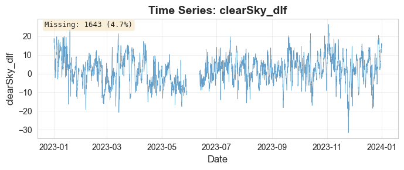
    

    
    Plotting: clearSky_ulf

    

    

    
    Plotting: clouds

    

    

    
    Plotting: humidity

    
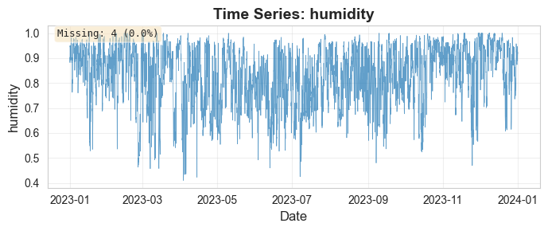
    

    
    Plotting: mxlD

    
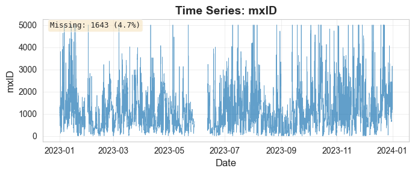
    

    
    Plotting: pressure

    
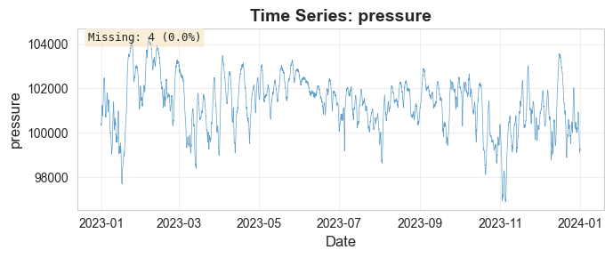
    

    
    Plotting: radiation

    
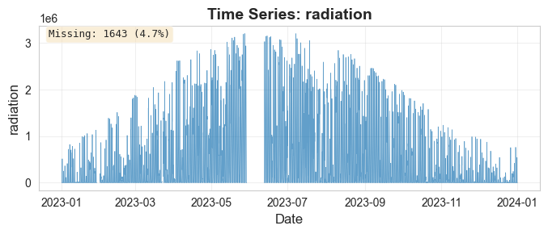
    

    
    Plotting: snowDepth

    
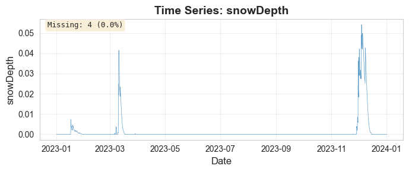
    

    
    Plotting: temp

    
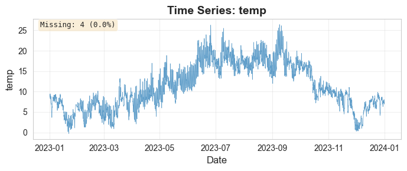
    

    
    Plotting: winddeg

    
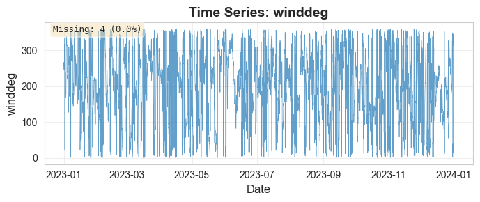
    

    
    Plotting: windspeed

    
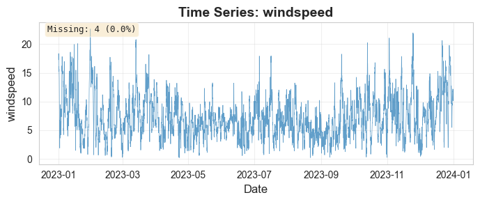
    

    
    Plotting: windspeed_100m

    
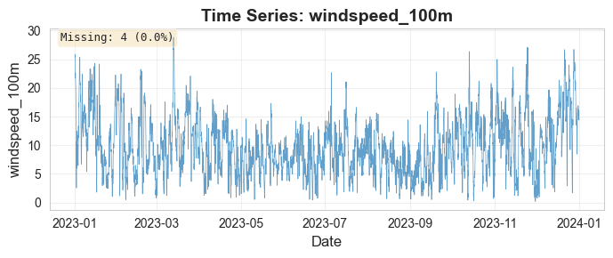
    

    
    ======================================================================
    SECTION 3: PRICING VARIABLES
    ======================================================================
    
    Plotting: APX

    

    

    
    ======================================================================
    SECTION 4: LOAD PROFILE VARIABLES
    ======================================================================
    
    Plotting: E1A_AMI_A

    

    

    
    Plotting: E1A_AMI_I

    

    

    
    Plotting: E1A_AZI_A

    
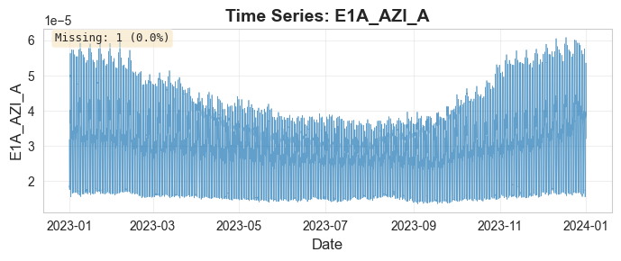
    

    
    Plotting: E1A_AZI_I

    

    

    
    Plotting: E1B_AMI_A

    
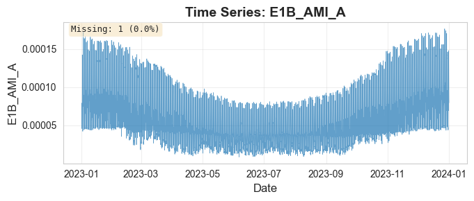
    

    
    Plotting: E1B_AMI_I

    
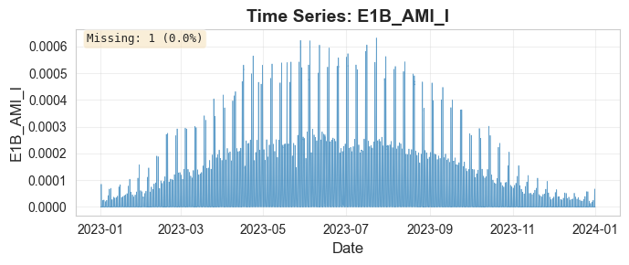
    

    
    Plotting: E1B_AZI_A

    

    

    
    Plotting: E1B_AZI_I

    

    

    
    Plotting: E1C_AMI_A

    

    

    
    Plotting: E1C_AMI_I

    

    

    
    Plotting: E1C_AZI_A

    
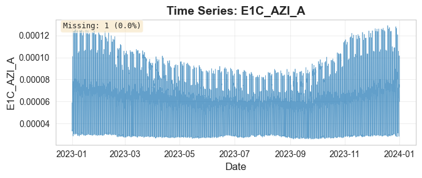
    

    
    Plotting: E1C_AZI_I

    

    

    
    Plotting: E2A_AMI_A

    

    

    
    Plotting: E2A_AMI_I

    
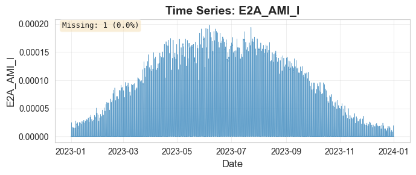
    

    
    Plotting: E2A_AZI_A

    
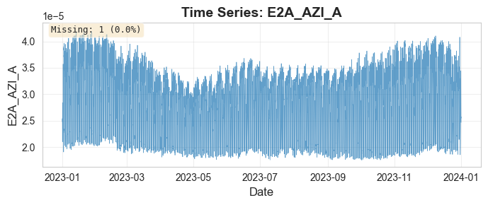
    

    
    Plotting: E2A_AZI_I

    

    

    
    Plotting: E2B_AMI_A

    

    

    
    Plotting: E2B_AMI_I

    

    

    
    Plotting: E2B_AZI_A

    
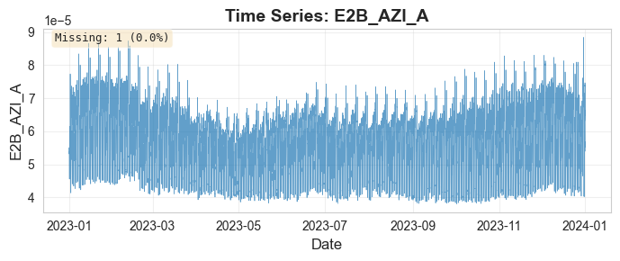
    

    
    Plotting: E2B_AZI_I

    

    

    
    Plotting: E3A_A

    

    

    
    Plotting: E3A_I

    

    

    
    Plotting: E3B_A

    

    

    
    Plotting: E3B_I

    
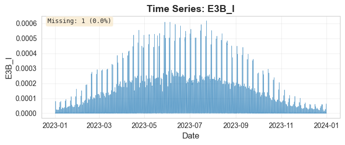
    

    
    Plotting: E3C_A

    
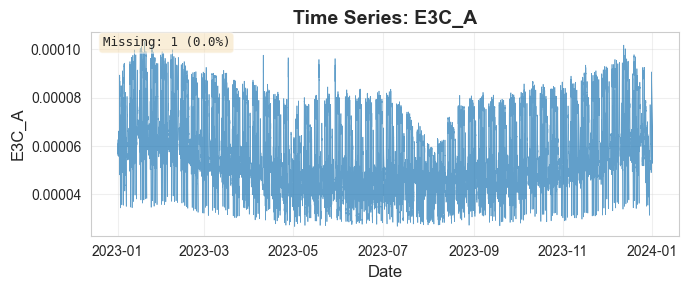
    

    
    Plotting: E3C_I

    

    

    
    Plotting: E3D_A

    

    

    
    Plotting: E3D_I

    

    

    
    Plotting: E4A_A

    

    

    
    Plotting: E4A_I

    

    

    
    ======================================================================
    EDA PART 2 (TIME SERIES PLOTS) COMPLETE
    ======================================================================

