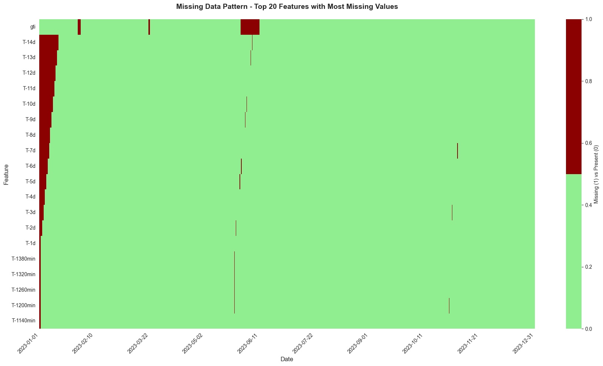

    ======================================================================
    LOADING PROCESSED DATA
    ======================================================================
    Loading from: /home/chris/research/load-forecast/data/processed/data_with_features.csv

    Loaded data shape: (35041, 133)
    Date range: 2023-01-01 00:00:00 to 2024-01-01 00:00:00
    Loading original data from: /home/chris/research/load-forecast/data/raw_inputs/input_data_sun_heavy.csv

    
    Original columns: 44
    Total columns: 133
    New features: 89

    
    ======================================================================
    MISSING VALUE ANALYSIS - NEW FEATURES ONLY
    ======================================================================
    
    New features with missing values: 46 out of 89
    Total observations: 35,041
    
    ----------------------------------------------------------------------
    Feature                                  Missing      Percentage  
    ----------------------------------------------------------------------
    gti                                           1,643         4.69%
    T-14d                                         1,366         3.90%
    T-13d                                         1,270         3.62%
    T-12d                                         1,174         3.35%
    T-11d                                         1,078         3.08%
    T-10d                                           982         2.80%
    T-9d                                            886         2.53%
    T-8d                                            790         2.25%
    T-7d                                            694         1.98%
    T-6d                                            598         1.71%
    T-5d                                            502         1.43%
    T-4d                                            406         1.16%
    T-3d                                            310         0.88%
    T-2d                                            214         0.61%
    T-1d                                            118         0.34%
    T-1380min                                       114         0.33%
    T-1320min                                       110         0.31%
    T-1260min                                       106         0.30%
    T-1200min                                       102         0.29%
    T-1140min                                        98         0.28%
    
    ... and 26 more features with missing values
    
    ----------------------------------------------------------------------
    Summary Statistics                      
    ----------------------------------------------------------------------
    Total missing cells (new features):          13,733
    Average missing per feature:                  298.5
    Median missing per feature:                      84
    Max missing in any feature:                   1,643

    
    ======================================================================
    MISSING DATA VISUALIZATION - TOP 20 FEATURES
    ======================================================================
    
    Visualizing top 20 features with most missing values
    Sampling every 35th row for visualization clarity

    

    

    
    Missing value statistics for visualized features:
    ----------------------------------------------------------------------
     1. gti                                    1,643 (  4.7%)
     2. T-14d                                  1,366 (  3.9%)
     3. T-13d                                  1,270 (  3.6%)
     4. T-12d                                  1,174 (  3.4%)
     5. T-11d                                  1,078 (  3.1%)
     6. T-10d                                    982 (  2.8%)
     7. T-9d                                     886 (  2.5%)
     8. T-8d                                     790 (  2.3%)
     9. T-7d                                     694 (  2.0%)
    10. T-6d                                     598 (  1.7%)
    11. T-5d                                     502 (  1.4%)
    12. T-4d                                     406 (  1.2%)
    13. T-3d                                     310 (  0.9%)
    14. T-2d                                     214 (  0.6%)
    15. T-1d                                     118 (  0.3%)
    16. T-1380min                                114 (  0.3%)
    17. T-1320min                                110 (  0.3%)
    18. T-1260min                                106 (  0.3%)
    19. T-1200min                                102 (  0.3%)
    20. T-1140min                                 98 (  0.3%)

    
    ======================================================================
    SUMMARY STATISTICS - NEW FEATURES
    ======================================================================
    
    New features grouped by type:
    ----------------------------------------------------------------------
    
    Time-based (cyclic): 8 features
      - season_sine                         (missing:      0 =   0.0%)
      - season_cosine                       (missing:      0 =   0.0%)
      - day0fweek_sine                      (missing:      0 =   0.0%)
      - day0fweek_cosine                    (missing:      0 =   0.0%)
      - month_sine                          (missing:      0 =   0.0%)
      - month_cosine                        (missing:      0 =   0.0%)
      - time0fday_sine                      (missing:      0 =   0.0%)
      - time0fday_cosine                    (missing:      0 =   0.0%)
    
    Time-based (categorical): 9 features
      - IsWeekendDay                        (missing:      0 =   0.0%)
      - IsWeekDay                           (missing:      0 =   0.0%)
      - IsSunday                            (missing:      0 =   0.0%)
      - Month                               (missing:      0 =   0.0%)
      - Quarter                             (missing:      0 =   0.0%)
      - is_national_holiday                 (missing:      0 =   0.0%)
      - is_bridgeday                        (missing:      0 =   0.0%)
      - is_schoolholiday                    (missing:      0 =   0.0%)
      - daylight_continuous                 (missing:      0 =   0.0%)
    
    Lag features: 40 features
      - T-900min                            (missing:     82 =   0.2%)
      - T-780min                            (missing:     74 =   0.2%)
      - T-15min                             (missing:     23 =   0.1%)
      - T-660min                            (missing:     66 =   0.2%)
      - T-540min                            (missing:     58 =   0.2%)
      - T-30min                             (missing:     24 =   0.1%)
      - T-420min                            (missing:     50 =   0.1%)
      - T-1320min                           (missing:    110 =   0.3%)
      - T-300min                            (missing:     42 =   0.1%)
      - T-45min                             (missing:     25 =   0.1%)
      - T-1200min                           (missing:    102 =   0.3%)
      - T-180min                            (missing:     34 =   0.1%)
      - T-1080min                           (missing:     94 =   0.3%)
      - T-60min                             (missing:     26 =   0.1%)
      - T-960min                            (missing:     86 =   0.2%)
      - T-840min                            (missing:     78 =   0.2%)
      - T-720min                            (missing:     70 =   0.2%)
      - T-600min                            (missing:     62 =   0.2%)
      - T-480min                            (missing:     54 =   0.2%)
      - T-1380min                           (missing:    114 =   0.3%)
      - T-360min                            (missing:     46 =   0.1%)
      - T-1260min                           (missing:    106 =   0.3%)
      - T-240min                            (missing:     38 =   0.1%)
      - T-1140min                           (missing:     98 =   0.3%)
      - T-120min                            (missing:     30 =   0.1%)
      - T-1020min                           (missing:     90 =   0.3%)
      - T-1d                                (missing:    118 =   0.3%)
      - T-2d                                (missing:    214 =   0.6%)
      - T-3d                                (missing:    310 =   0.9%)
      - T-4d                                (missing:    406 =   1.2%)
      - T-5d                                (missing:    502 =   1.4%)
      - T-6d                                (missing:    598 =   1.7%)
      - T-7d                                (missing:    694 =   2.0%)
      - T-8d                                (missing:    790 =   2.3%)
      - T-9d                                (missing:    886 =   2.5%)
      - T-10d                               (missing:    982 =   2.8%)
      - T-11d                               (missing:  1,078 =   3.1%)
      - T-12d                               (missing:  1,174 =   3.4%)
      - T-13d                               (missing:  1,270 =   3.6%)
      - T-14d                               (missing:  1,366 =   3.9%)
    
    Holiday features: 3 features
      - is_national_holiday                 (missing:      0 =   0.0%)
      - is_bridgeday                        (missing:      0 =   0.0%)
      - is_schoolholiday                    (missing:      0 =   0.0%)
    
    Other features: 32 features
      - is_nieuwjaarsdag                    (missing:      0 =   0.0%)
      - is_goede_vrijdag                    (missing:      0 =   0.0%)
      - is_eerste_paasdag                   (missing:      0 =   0.0%)
      - is_tweede_paasdag                   (missing:      0 =   0.0%)
      - is_koningsdag                       (missing:      0 =   0.0%)
      - is_hemelvaart                       (missing:      0 =   0.0%)
      - is_eerste_pinksterdag               (missing:      0 =   0.0%)
      - is_tweede_pinksterdag               (missing:      0 =   0.0%)
      - is_eerste_kerstdag                  (missing:      0 =   0.0%)
      - is_tweede_kerstdag                  (missing:      0 =   0.0%)
      - is_bevrijdingsdag                   (missing:      0 =   0.0%)
      - is_bouwvakmidden                    (missing:      0 =   0.0%)
      - is_zomervakantiezuid                (missing:      0 =   0.0%)
      - is_herfstvakantiezuid               (missing:      0 =   0.0%)
      - is_zomervakantiemidden              (missing:      0 =   0.0%)
      - is_kerstvakantie                    (missing:      0 =   0.0%)
      - is_bouwvakzuid                      (missing:      0 =   0.0%)
      - is_voorjaarsvakantiezuid            (missing:      0 =   0.0%)
      - is_meivakantie                      (missing:      0 =   0.0%)
      - is_voorjaarsvakantienoord           (missing:      0 =   0.0%)
      - is_zomervakantienoord               (missing:      0 =   0.0%)
      - is_herfstvakantiemidden             (missing:      0 =   0.0%)
      - is_bouwvaknoord                     (missing:      0 =   0.0%)
      - is_voorjaarsvakantiemidden          (missing:      0 =   0.0%)
      - is_herfstvakantienoord              (missing:      0 =   0.0%)
      - windpowerFit_harm_arome             (missing:      4 =   0.0%)
      - saturation_pressure                 (missing:      4 =   0.0%)
      - vapour_pressure                     (missing:      4 =   0.0%)
      - dewpoint                            (missing:      4 =   0.0%)
      - air_density                         (missing:      4 =   0.0%)
      - dni                                 (missing:      0 =   0.0%)
      - gti                                 (missing:  1,643 =   4.7%)

    
    ======================================================================
    FEATURE ANALYSIS COMPLETE
    ======================================================================
    
    Key insights:
      - Total new features: 89
      - Features with missing values: 46
      - Highest missing value rate: 4.7%
      - Most affected feature: gti
    
    Next steps:
      1. Decide on missing value handling strategy (dropna, forward-fill, etc.)
      2. Proceed to model training

