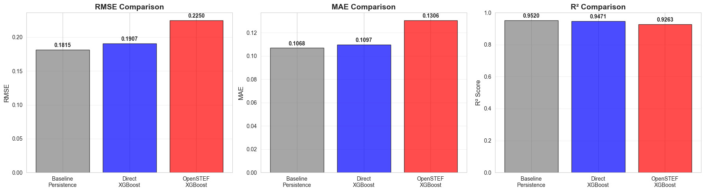
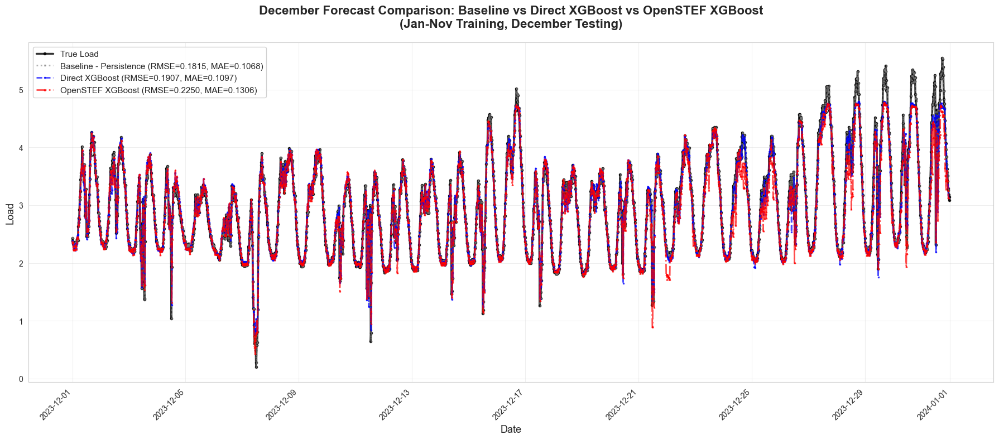
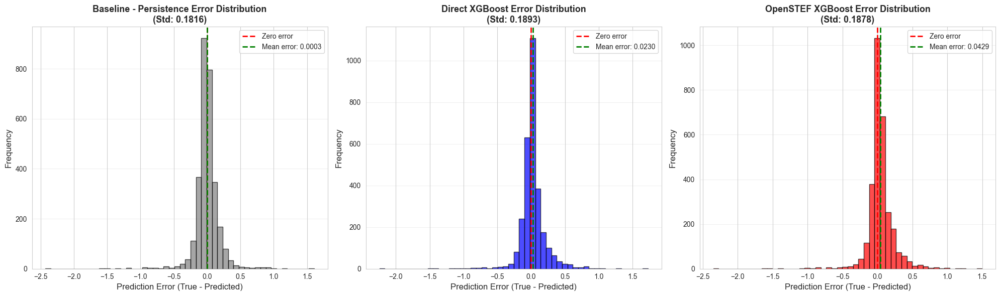

    "Train and Evaluate Models using Jan-Nov/Dec split.\n\nThis script combines training and evaluation:\n1. Loads preprocessed feature-enriched data from data/processed/data_with_features.csv\n2. Splits data: Jan-Nov for training, December for testing\n3. Trains three models:\n   a) Baseline (Persistence): Uses last known load value as prediction\n   b) Direct XGBoost with manual configuration\n   c) OpenSTEF XGBOpenstfRegressor with OpenSTEF's training approach\n4. Evaluates models on December test period\n5. Creates comprehensive visualizations:\n   - Metrics comparison bar charts\n   - Time series plots\n   - Scatter plots for each model\n   - Error distribution histograms\n6. Saves training results to models/jan_nov_dec/training_results.json\n7. Exports metrics to metrics/jan_nov_dec_evaluation.json for DVC tracking\n\nUses Jupyter cell blocks (# %%) for interactive execution.\n"

    ======================================================================
    JAN-NOV vs DECEMBER MODEL TRAINING AND EVALUATION
    ======================================================================
    Experiment: jan_nov_dec
    Random seed: 42

    
    ======================================================================
    LOADING FEATURE-ENRICHED DATA
    ======================================================================
    Loading from: /home/chris/research/load-forecast/data/processed/data_with_features.csv
    Ensured all directories exist relative to: /home/chris/research/load-forecast

    Loaded data shape: (35041, 133)
    Date range: 2023-01-01 00:00:00 to 2024-01-01 00:00:00
    Number of features: 133

    
    ======================================================================
    CLEANING DATA - REMOVING ROWS WITH MISSING VALUES
    ======================================================================
    Shape before cleaning: (35041, 133)
    Shape after dropping NaN: (31705, 133)
    Date range: 2023-01-15 00:15:00 to 2023-12-31 23:00:00

    
    ======================================================================
    SPLITTING DATA: JAN-NOV TRAINING, DECEMBER TESTING
    ======================================================================
    Years in data: Index([2023], dtype='int32')
    Using year 2023 for test split
    
    Train data: 28732 rows
      Date range: 2023-01-15 00:15:00 to 2023-11-30 23:45:00
      Months included: [1, 2, 3, 4, 5, 6, 7, 8, 9, 10, 11]
    
    Test data (December): 2973 rows
      Date range: 2023-12-01 00:00:00 to 2023-12-31 23:00:00

    
    ======================================================================
    PREPARING DATA FOR MODELS
    ======================================================================
    X_train shape: (28732, 132)
    y_train shape: (28732,)
    X_test shape: (2973, 132)
    y_test shape: (2973,)

    
    ======================================================================
    TRAINING BASELINE MODEL (PERSISTENCE)
    ======================================================================
      RMSE: 0.1815
      MAE:  0.1068
      R²:   0.9520

    
    ======================================================================
    TRAINING DIRECT XGBOOST MODEL
    ======================================================================

      RMSE: 0.1907
      MAE:  0.1097
      R²:   0.9471

    
    ======================================================================
    TRAINING OPENSTEF XGBOOST MODEL
    ======================================================================

    [0]	validation_0-rmse:1.38564	validation_1-rmse:1.47307

    [1]	validation_0-rmse:1.01453	validation_1-rmse:1.07873

    [2]	validation_0-rmse:0.76658	validation_1-rmse:0.81471

    [3]	validation_0-rmse:0.60497	validation_1-rmse:0.64263

    [4]	validation_0-rmse:0.50398	validation_1-rmse:0.53339

    [5]	validation_0-rmse:0.44181	validation_1-rmse:0.47245

    [6]	validation_0-rmse:0.40523	validation_1-rmse:0.43711

    [7]	validation_0-rmse:0.38275	validation_1-rmse:0.41850

    [8]	validation_0-rmse:0.36842	validation_1-rmse:0.41048

    [9]	validation_0-rmse:0.35837	validation_1-rmse:0.40403

    [10]	validation_0-rmse:0.35127	validation_1-rmse:0.40172

    [11]	validation_0-rmse:0.34477	validation_1-rmse:0.40013

    [12]	validation_0-rmse:0.33886	validation_1-rmse:0.39884

    [13]	validation_0-rmse:0.33480	validation_1-rmse:0.39741

    [14]	validation_0-rmse:0.33152	validation_1-rmse:0.39752

    [15]	validation_0-rmse:0.32716	validation_1-rmse:0.39642

    [16]	validation_0-rmse:0.32084	validation_1-rmse:0.39536

    [17]	validation_0-rmse:0.31878	validation_1-rmse:0.39571

    [18]	validation_0-rmse:0.31638	validation_1-rmse:0.39659

    [19]	validation_0-rmse:0.31343	validation_1-rmse:0.39713

    [20]	validation_0-rmse:0.30990	validation_1-rmse:0.39722

    [21]	validation_0-rmse:0.30782	validation_1-rmse:0.39761

    [22]	validation_0-rmse:0.30348	validation_1-rmse:0.39666

    [23]	validation_0-rmse:0.30014	validation_1-rmse:0.39751

    [24]	validation_0-rmse:0.29832	validation_1-rmse:0.39812

    [25]	validation_0-rmse:0.29442	validation_1-rmse:0.39795

    [26]	validation_0-rmse:0.29220	validation_1-rmse:0.39844

      RMSE: 0.2250
      MAE:  0.1306
      R²:   0.9263

    
    ======================================================================
    SAVING TRAINING RESULTS
    ======================================================================

    Training results saved to: /home/chris/research/load-forecast/models/jan_nov_dec/training_results.json

    
    ======================================================================
    TRAINING SUMMARY
    ======================================================================
    
    Model                RMSE         MAE          R²          
    ------------------------------------------------------------
    Baseline             0.1815       0.1068       0.9520      
    Direct XGBoost       0.1907       0.1097       0.9471      
    OpenSTEF XGBoost     0.2250       0.1306       0.9263      

    
    ======================================================================
    CREATING VISUALIZATIONS
    ======================================================================

    

    

    

    

    

    

    

    

    
    ======================================================================
    EXPORTING METRICS FOR DVC TRACKING
    ======================================================================
    Metrics saved to: metrics/jan_nov_dec_evaluation.json

    
    ======================================================================
    TRAINING AND EVALUATION COMPLETE
    ======================================================================
    
    Analyzed December 2023 test period
    Compared 3 models: Baseline, Direct XGBoost, OpenSTEF XGBoost
    Training results saved to: /home/chris/research/load-forecast/models/jan_nov_dec/training_results.json
    Metrics exported to: metrics/jan_nov_dec_evaluation.json
    
    Key Findings:
      - Best RMSE: 0.1815 (Baseline Persistence)
      - Direct XGBoost RMSE improvement over baseline: -5.05%
      - OpenSTEF XGBoost RMSE improvement over baseline: -23.96%

