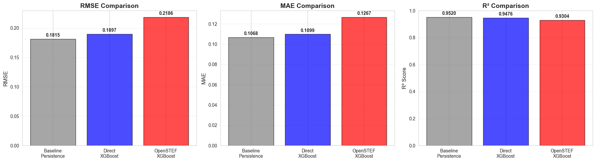
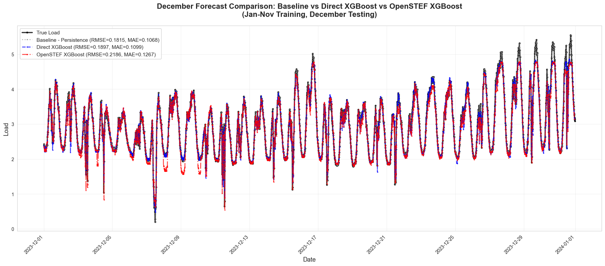
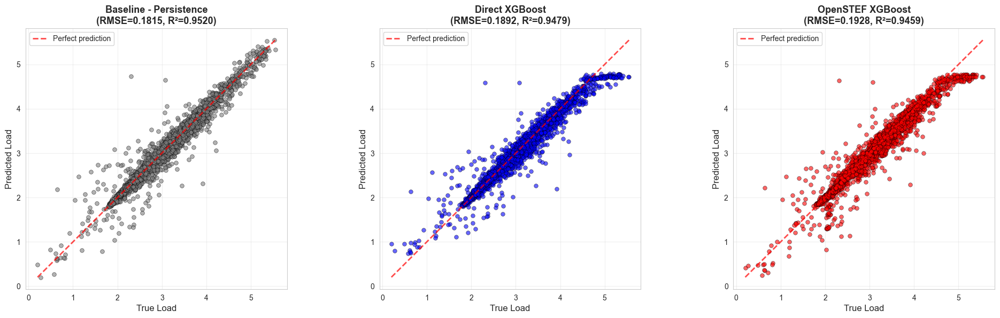
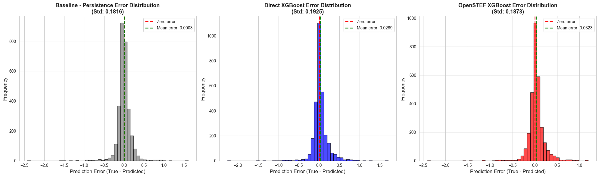

    'Evaluate Jan-Nov vs December Model Training Results.\n\nThis report:\n1. Loads training results from models/jan_nov_dec/training_results.json\n2. Recreates predictions for visualization\n3. Creates comprehensive visualizations:\n   - Line plots comparing all three models\n   - Scatter plots for each model\n   - Error distribution histograms\n   - Metrics comparison bar charts\n4. Exports metrics to metrics/jan_nov_dec_evaluation.json for DVC tracking\n\nThis script is designed to be run via generate_report.sh to produce HTML and Markdown outputs.\nUses Jupyter cell blocks (# %%) for interactive execution.\n'

    ======================================================================
    JAN-NOV vs DECEMBER MODEL EVALUATION REPORT
    ======================================================================
    Experiment: jan_nov_dec

    
    Loading results from: /home/chris/research/load-forecast/models/jan_nov_dec/training_results.json
    Training timestamp: 2025-12-23T09:08:15.762369

    
    ======================================================================
    EXPERIMENT CONFIGURATION
    ======================================================================
    Test year: 2023
    Test month: 12
    Random seed: 42

    
    ======================================================================
    LOADING DATA FOR VISUALIZATION
    ======================================================================

    Loaded data shape: (31705, 133)
    Full data shape (with NaN): (35041, 133)

    
    ======================================================================
    RECREATING PREDICTIONS FOR VISUALIZATION
    ======================================================================
    Recreated train/test split
      Train: 28732 rows
      Test: 2973 rows

    [0]	validation_0-rmse:1.40519	validation_1-rmse:1.35326

    [1]	validation_0-rmse:1.02634	validation_1-rmse:0.99507

    [2]	validation_0-rmse:0.77252	validation_1-rmse:0.75941

    [3]	validation_0-rmse:0.60665	validation_1-rmse:0.60799

    [4]	validation_0-rmse:0.50285	validation_1-rmse:0.51712

    [5]	validation_0-rmse:0.43901	validation_1-rmse:0.46651

    [6]	validation_0-rmse:0.40104	validation_1-rmse:0.43936

    [7]	validation_0-rmse:0.37771	validation_1-rmse:0.42463

    [8]	validation_0-rmse:0.36326	validation_1-rmse:0.41673

    [9]	validation_0-rmse:0.35392	validation_1-rmse:0.41309

    [10]	validation_0-rmse:0.34719	validation_1-rmse:0.41174

    [11]	validation_0-rmse:0.34076	validation_1-rmse:0.41120

    [12]	validation_0-rmse:0.33662	validation_1-rmse:0.41056

    [13]	validation_0-rmse:0.33135	validation_1-rmse:0.41119

    [14]	validation_0-rmse:0.32518	validation_1-rmse:0.41110

    [15]	validation_0-rmse:0.32215	validation_1-rmse:0.41144

    [16]	validation_0-rmse:0.32020	validation_1-rmse:0.41127

    [17]	validation_0-rmse:0.31598	validation_1-rmse:0.41147

    [18]	validation_0-rmse:0.31293	validation_1-rmse:0.41165

    [19]	validation_0-rmse:0.30793	validation_1-rmse:0.41187

    [20]	validation_0-rmse:0.30469	validation_1-rmse:0.41305

    [21]	validation_0-rmse:0.30283	validation_1-rmse:0.41321

    [22]	validation_0-rmse:0.30036	validation_1-rmse:0.41372

    Predictions recreated successfully

    
    ======================================================================
    EXPORTING METRICS FOR DVC TRACKING
    ======================================================================
    ✓ Metrics saved to: metrics/jan_nov_dec_evaluation.json

    
    ======================================================================
    RESULTS SUMMARY
    ======================================================================
    
    Model                RMSE         MAE          R²          
    ------------------------------------------------------------
    Baseline             0.1815       0.1068       0.9520      
    Direct XGBoost       0.1897       0.1099       0.9476      
    OpenSTEF XGBoost     0.2186       0.1267       0.9304      

    

    

    

    

    

    

    

    

    
    ======================================================================
    EVALUATION REPORT COMPLETE
    ======================================================================
    
    ✓ Analyzed December 2023 test period
    ✓ Compared 3 models: Baseline, Direct XGBoost, OpenSTEF XGBoost
    ✓ Metrics exported to: metrics/jan_nov_dec_evaluation.json
    
    Key Findings:
      - Best RMSE: 0.1815 (Baseline Persistence)
      - Direct XGBoost RMSE improvement over baseline: -4.52%
      - OpenSTEF XGBoost RMSE improvement over baseline: -20.42%

