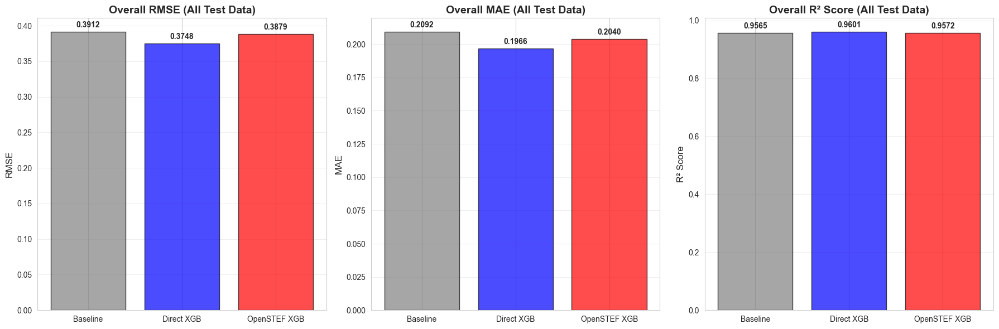
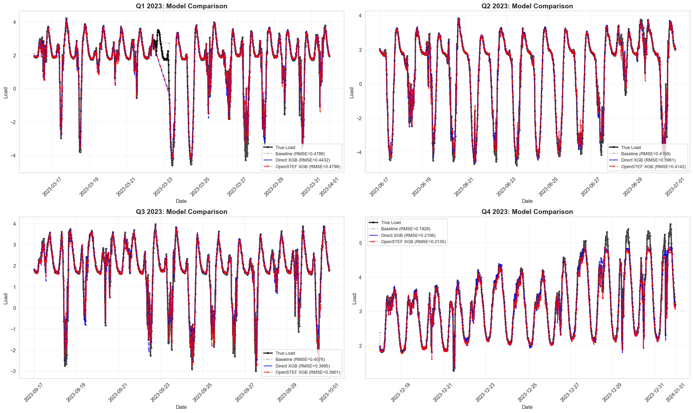
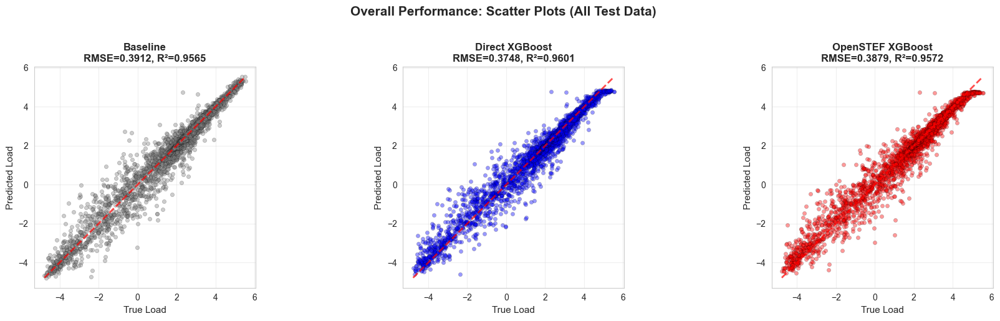
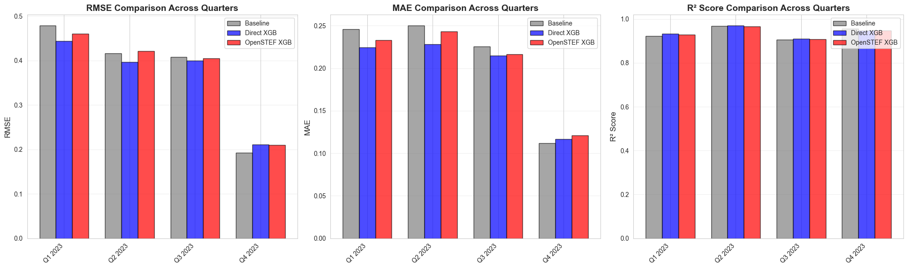

    "Train and Evaluate Models using Quarterly Splits.\n\nThis script combines training and evaluation:\n1. Loads preprocessed feature-enriched data from data/processed/data_with_features.csv\n2. Splits data into 4 calendar quarters (Q1: Jan-Mar, Q2: Apr-Jun, Q3: Jul-Sep, Q4: Oct-Dec)\n3. For each quarter, uses first part for training and last 14 days (with >95% coverage) for testing\n4. Trains three models (combined across all quarters):\n   a) Baseline (Persistence): Uses last known load value as prediction\n   b) Direct XGBoost with manual configuration\n   c) OpenSTEF XGBOpenstfRegressor with OpenSTEF's training approach\n5. Evaluates models on:\n   - Overall test data (all quarters combined)\n   - Individual quarterly test periods\n6. Creates comprehensive visualizations\n7. Saves training results to models/quarterly_split/training_results.json\n8. Exports metrics to metrics/quarterly_split_evaluation.json for DVC tracking\n\nUses Jupyter cell blocks (# %%) for interactive execution.\n"

    ======================================================================
    QUARTERLY MODEL TRAINING AND EVALUATION
    ======================================================================
    Experiment: quarterly_split
    Test period: Last 14 days per quarter
    Minimum data coverage: 95.0%
    Random seed: 42

    
    ======================================================================
    LOADING FEATURE-ENRICHED DATA
    ======================================================================
    Loading from: /home/chris/research/load-forecast/data/processed/data_with_features.csv
    Ensured all directories exist relative to: /home/chris/research/load-forecast

    Loaded data shape: (35041, 133)
    Date range: 2023-01-01 00:00:00 to 2024-01-01 00:00:00
    Number of features: 133

    
    ======================================================================
    CLEANING DATA - REMOVING ROWS WITH MISSING VALUES
    ======================================================================
    Shape before cleaning: (35041, 133)
    Shape after dropping NaN: (31705, 133)
    Date range: 2023-01-15 00:15:00 to 2023-12-31 23:00:00

    
    ======================================================================
    SPLITTING DATA INTO TRAIN/TEST BY QUARTERS
    ======================================================================
    
    Combined train size: 25843 rows (across 4 quarters)
    Combined test size: 5482 rows
    Train period: 2023-01-15 00:15:00 to 2023-12-17 00:00:00
    Test period: 2023-03-16 00:00:00 to 2023-12-31 23:00:00
    
    Quarter breakdown:
      Q1 2023: Train 5437 rows, Test 1453 rows
      Q2 2023: Train 5786 rows, Test 1344 rows
      Q3 2023: Train 7393 rows, Test 1344 rows
      Q4 2023: Train 7227 rows, Test 1341 rows

    
    Experiment directory: /home/chris/research/load-forecast/models/quarterly_split

    
    ======================================================================
    MODEL 1: BASELINE (PERSISTENCE)
    ======================================================================
    Strategy: Predict t using load value from t-1

    Overall metrics: RMSE=0.3912, MAE=0.2092, R²=0.9565

    
    ======================================================================
    MODEL 2: DIRECT XGBOOST
    ======================================================================
    Strategy: Train XGBoost with manual hyperparameters
    Train: 25843 samples, 132 features
    Test: 5482 samples

    Overall metrics: RMSE=0.3748, MAE=0.1966, R²=0.9601

    
    ======================================================================
    MODEL 3: OPENSTEF XGBOOST
    ======================================================================
    Strategy: Use OpenSTEF's training approach with train/validation split
    Training data shape (with horizon): (25843, 134)
    Train split: 21940 samples
    Validation split: 3903 samples

    [0]	validation_0-rmse:1.36986	validation_1-rmse:1.39097

    [1]	validation_0-rmse:0.99993	validation_1-rmse:1.03326

    [2]	validation_0-rmse:0.75097	validation_1-rmse:0.79917

    [3]	validation_0-rmse:0.58789	validation_1-rmse:0.64542

    [4]	validation_0-rmse:0.48479	validation_1-rmse:0.55652

    [5]	validation_0-rmse:0.42092	validation_1-rmse:0.50472

    [6]	validation_0-rmse:0.38235	validation_1-rmse:0.47824

    [7]	validation_0-rmse:0.35936	validation_1-rmse:0.46297

    [8]	validation_0-rmse:0.34416	validation_1-rmse:0.45441

    [9]	validation_0-rmse:0.33311	validation_1-rmse:0.45239

    [10]	validation_0-rmse:0.32549	validation_1-rmse:0.45204

    [11]	validation_0-rmse:0.31965	validation_1-rmse:0.45265

    [12]	validation_0-rmse:0.31359	validation_1-rmse:0.45308

    [13]	validation_0-rmse:0.30877	validation_1-rmse:0.45265

    [14]	validation_0-rmse:0.30470	validation_1-rmse:0.45469

    [15]	validation_0-rmse:0.30011	validation_1-rmse:0.45418

    [16]	validation_0-rmse:0.29593	validation_1-rmse:0.45406

    [17]	validation_0-rmse:0.29326	validation_1-rmse:0.45664

    [18]	validation_0-rmse:0.29127	validation_1-rmse:0.45702

    [19]	validation_0-rmse:0.28934	validation_1-rmse:0.45684

    [20]	validation_0-rmse:0.28368	validation_1-rmse:0.45659

    Overall metrics: RMSE=0.3893, MAE=0.2040, R²=0.9569

    
    ======================================================================
    EVALUATING ON INDIVIDUAL QUARTERLY TEST SETS
    ======================================================================
    
    Q1 2023 (1453 predictions):
      Baseline    - RMSE: 0.4788, MAE: 0.2460, R²: 0.9219
      Direct XGB  - RMSE: 0.4432, MAE: 0.2243, R²: 0.9331
      OpenSTEF XGB- RMSE: 0.4798, MAE: 0.2404, R²: 0.9216
    
    Q2 2023 (1344 predictions):
      Baseline    - RMSE: 0.4159, MAE: 0.2504, R²: 0.9682
      Direct XGB  - RMSE: 0.3961, MAE: 0.2284, R²: 0.9712
      OpenSTEF XGB- RMSE: 0.4142, MAE: 0.2396, R²: 0.9685
    
    Q3 2023 (1344 predictions):
      Baseline    - RMSE: 0.4076, MAE: 0.2256, R²: 0.9069
      Direct XGB  - RMSE: 0.3995, MAE: 0.2145, R²: 0.9106
      OpenSTEF XGB- RMSE: 0.3901, MAE: 0.2069, R²: 0.9147
    
    Q4 2023 (1341 predictions):
      Baseline    - RMSE: 0.1928, MAE: 0.1116, R²: 0.9559
      Direct XGB  - RMSE: 0.2106, MAE: 0.1166, R²: 0.9474
      OpenSTEF XGB- RMSE: 0.2135, MAE: 0.1261, R²: 0.9459

    
    ======================================================================
    SAVING TRAINING RESULTS
    ======================================================================
    Training results saved to: /home/chris/research/load-forecast/models/quarterly_split/training_results.json

    
    ======================================================================
    SUMMARY: OVERALL PERFORMANCE
    ======================================================================
    
    Combined model trained on all 4 quarters, tested on all test data:
    Model              RMSE         MAE          R²          
    ------------------------------------------------------------
    baseline           0.3912       0.2092       0.9565      
    direct_xgb         0.3748       0.1966       0.9601      
    openstef_xgb       0.3893       0.2040       0.9569      
    
    ======================================================================
    SUMMARY: PER-QUARTER PERFORMANCE
    ======================================================================
    
    Quarter         Model              RMSE         MAE          R²          
    ---------------------------------------------------------------------------
    Q1 2023         baseline           0.4788       0.2460       0.9219      
    Q1 2023         direct_xgb         0.4432       0.2243       0.9331      
    Q1 2023         openstef_xgb       0.4798       0.2404       0.9216      
    ---------------------------------------------------------------------------
    Q2 2023         baseline           0.4159       0.2504       0.9682      
    Q2 2023         direct_xgb         0.3961       0.2284       0.9712      
    Q2 2023         openstef_xgb       0.4142       0.2396       0.9685      
    ---------------------------------------------------------------------------
    Q3 2023         baseline           0.4076       0.2256       0.9069      
    Q3 2023         direct_xgb         0.3995       0.2145       0.9106      
    Q3 2023         openstef_xgb       0.3901       0.2069       0.9147      
    ---------------------------------------------------------------------------
    Q4 2023         baseline           0.1928       0.1116       0.9559      
    Q4 2023         direct_xgb         0.2106       0.1166       0.9474      
    Q4 2023         openstef_xgb       0.2135       0.1261       0.9459      
    ---------------------------------------------------------------------------

    
    ======================================================================
    CREATING VISUALIZATIONS
    ======================================================================

    
    ======================================================================
    OVERALL METRICS (ALL TEST DATA COMBINED)
    ======================================================================
    
    Model              RMSE         MAE          R²          
    ------------------------------------------------------
    baseline           0.3912       0.2092       0.9565      
    direct_xgb         0.3748       0.1966       0.9601      
    openstef_xgb       0.3893       0.2040       0.9569      

    

    

    
    ======================================================================
    TIME SERIES VISUALIZATIONS
    ======================================================================

    

    

    
    ======================================================================
    SCATTER PLOTS (OVERALL - ALL TEST DATA)
    ======================================================================

    

    

    
    ======================================================================
    PER-QUARTER METRICS BREAKDOWN
    ======================================================================
    
    Quarter         Model              RMSE         MAE          R²          
    ---------------------------------------------------------------------------
    Q1 2023         baseline           0.4788       0.2460       0.9219      
    Q1 2023         direct_xgb         0.4432       0.2243       0.9331      
    Q1 2023         openstef_xgb       0.4798       0.2404       0.9216      
    ---------------------------------------------------------------------------
    Q2 2023         baseline           0.4159       0.2504       0.9682      
    Q2 2023         direct_xgb         0.3961       0.2284       0.9712      
    Q2 2023         openstef_xgb       0.4142       0.2396       0.9685      
    ---------------------------------------------------------------------------
    Q3 2023         baseline           0.4076       0.2256       0.9069      
    Q3 2023         direct_xgb         0.3995       0.2145       0.9106      
    Q3 2023         openstef_xgb       0.3901       0.2069       0.9147      
    ---------------------------------------------------------------------------
    Q4 2023         baseline           0.1928       0.1116       0.9559      
    Q4 2023         direct_xgb         0.2106       0.1166       0.9474      
    Q4 2023         openstef_xgb       0.2135       0.1261       0.9459      
    ---------------------------------------------------------------------------

    

    

    
    ======================================================================
    EXPORTING METRICS FOR DVC TRACKING
    ======================================================================
    Metrics saved to: metrics/quarterly_split_evaluation.json

    
    ======================================================================
    TRAINING AND EVALUATION COMPLETE
    ======================================================================
    
    Trained 1 combined model on all 4 quarters
    Evaluated on overall test set + 4 individual quarterly test sets
    Training results saved to: /home/chris/research/load-forecast/models/quarterly_split/training_results.json
    Metrics exported to: metrics/quarterly_split_evaluation.json
    
    Overall Results (All Test Data Combined):
      BASELINE: RMSE=0.3912, MAE=0.2092, R²=0.9565
      DIRECT_XGB: RMSE=0.3748, MAE=0.1966, R²=0.9601
      OPENSTEF_XGB: RMSE=0.3893, MAE=0.2040, R²=0.9569

