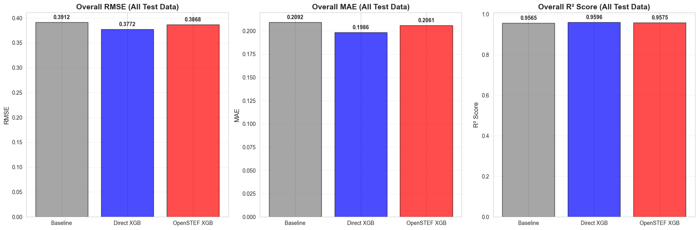
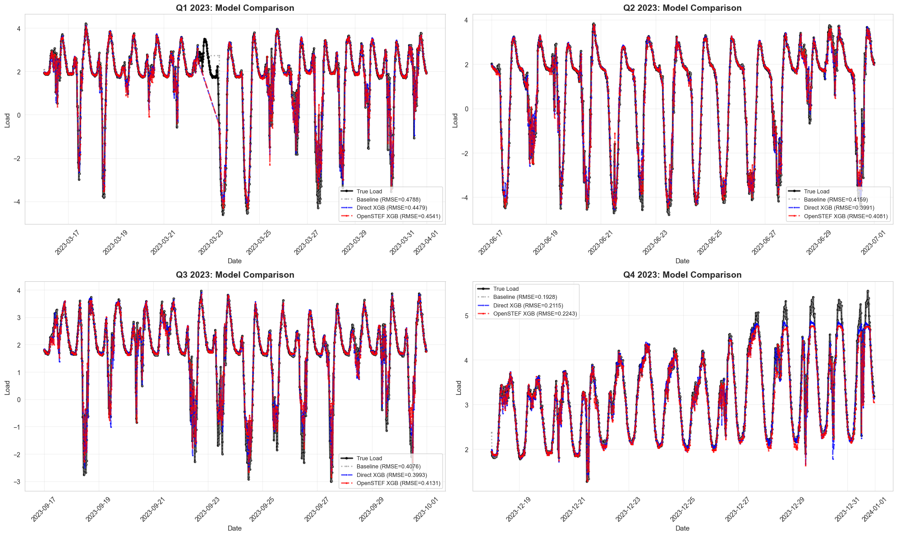
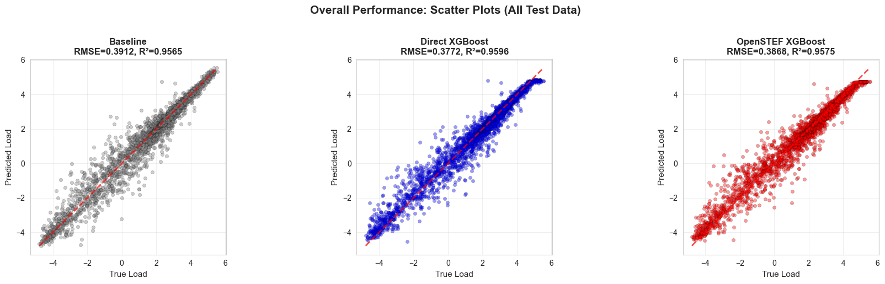
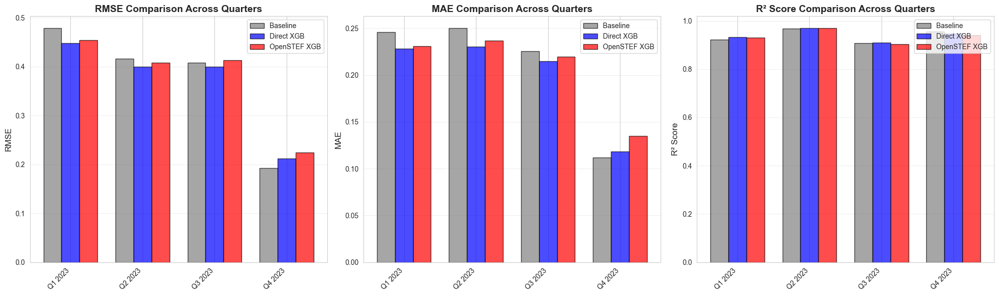

    "Train and Evaluate Models using Quarterly Splits.\n\nThis script combines training and evaluation:\n1. Loads preprocessed feature-enriched data from data/processed/data_with_features.csv\n2. Splits data into 4 calendar quarters (Q1: Jan-Mar, Q2: Apr-Jun, Q3: Jul-Sep, Q4: Oct-Dec)\n3. For each quarter:\n   - Uses first part for training\n   - Uses last 14 days (with >95% non-missing values) for testing\n4. Trains three models (combined across all quarters):\n   a) Baseline (Persistence): Uses last known load value as prediction\n   b) Direct XGBoost with manual configuration\n   c) OpenSTEF XGBOpenstfRegressor with OpenSTEF's training approach\n5. Evaluates models on:\n   - Overall test data (all quarters combined)\n   - Individual quarterly test periods\n6. Creates comprehensive visualizations:\n   - Overall metrics comparison\n   - Time series plots for each quarter\n   - Scatter plots for overall performance\n   - Per-quarter metrics comparison\n7. Saves training results to models/quarterly_split/training_results.json\n8. Exports metrics to metrics/quarterly_split_evaluation.json for DVC tracking\n\nUses Jupyter cell blocks (# %%) for interactive execution.\n"

    ======================================================================
    QUARTERLY MODEL TRAINING AND EVALUATION
    ======================================================================
    Experiment: quarterly_split
    Test period: Last 14 days per quarter
    Minimum data coverage: 95.0%
    Random seed: 42

    
    ======================================================================
    LOADING FEATURE-ENRICHED DATA
    ======================================================================
    Loading from: /home/chris/research/load-forecast/data/processed/data_with_features.csv
    Ensured all directories exist relative to: /home/chris/research/load-forecast

    Loaded data shape: (35041, 133)
    Date range: 2023-01-01 00:00:00 to 2024-01-01 00:00:00
    Number of features: 133

    
    ======================================================================
    CLEANING DATA - REMOVING ROWS WITH MISSING VALUES
    ======================================================================
    Shape before cleaning: (35041, 133)
    Shape after dropping NaN: (31705, 133)
    Date range: 2023-01-15 00:15:00 to 2023-12-31 23:00:00

    
    Experiment directory: /home/chris/research/load-forecast/models/quarterly_split

    
    ======================================================================
    PREPARING TRAIN/TEST SPLITS FOR EACH QUARTER
    ======================================================================
    
    Q1 2023:
      Train: 5437 rows (2023-01-15 00:15:00 to 2023-03-15 00:00:00)
      Test: 1453 rows (2023-03-16 00:00:00 to 2023-03-31 23:45:00)
      Features: 132
    
    Q2 2023:
      Train: 5786 rows (2023-04-01 00:00:00 to 2023-06-16 00:00:00)
      Test: 1344 rows (2023-06-17 00:00:00 to 2023-06-30 23:45:00)
      Features: 132
    
    Q3 2023:
      Train: 7393 rows (2023-07-01 00:00:00 to 2023-09-16 00:00:00)
      Test: 1344 rows (2023-09-17 00:00:00 to 2023-09-30 23:45:00)
      Features: 132
    
    Q4 2023:
      Train: 7227 rows (2023-10-01 00:00:00 to 2023-12-17 00:00:00)
      Test: 1341 rows (2023-12-18 00:00:00 to 2023-12-31 23:00:00)
      Features: 132

    
    ======================================================================
    TRAINING MODELS ON ALL QUARTERS COMBINED
    ======================================================================
    Strategy: Train on data from all 4 quarters, test on each quarter's test period
    Combined train size: 25843 rows (across 4 quarters)
    Combined test size: 5482 rows
    Train period: 2023-01-15 00:15:00 to 2023-12-17 00:00:00
    Test period: 2023-03-16 00:00:00 to 2023-12-31 23:00:00
    
    [COMBINED] Training Baseline (Persistence) Model...
      RMSE: 0.3912, MAE: 0.2092, R²: 0.9565
    
    [COMBINED] Training Direct XGBoost Model...

      RMSE: 0.3772, MAE: 0.1986, R²: 0.9596
    
    [COMBINED] Training OpenSTEF XGBoost Model...

    [0]	validation_0-rmse:1.37634	validation_1-rmse:1.34310

    [1]	validation_0-rmse:1.00627	validation_1-rmse:0.98603

    [2]	validation_0-rmse:0.75747	validation_1-rmse:0.75076

    [3]	validation_0-rmse:0.59539	validation_1-rmse:0.59640

    [4]	validation_0-rmse:0.49263	validation_1-rmse:0.50010

    [5]	validation_0-rmse:0.42893	validation_1-rmse:0.44409

    [6]	validation_0-rmse:0.39080	validation_1-rmse:0.41047

    [7]	validation_0-rmse:0.36643	validation_1-rmse:0.39495

    [8]	validation_0-rmse:0.35226	validation_1-rmse:0.38655

    [9]	validation_0-rmse:0.34146	validation_1-rmse:0.38175

    [10]	validation_0-rmse:0.33397	validation_1-rmse:0.37866

    [11]	validation_0-rmse:0.32752	validation_1-rmse:0.37696

    [12]	validation_0-rmse:0.32030	validation_1-rmse:0.37739

    [13]	validation_0-rmse:0.31411	validation_1-rmse:0.37741

    [14]	validation_0-rmse:0.30869	validation_1-rmse:0.37856

    

    [15]	validation_0-rmse:0.30511	validation_1-rmse:0.38061

    [16]	validation_0-rmse:0.30180	validation_1-rmse:0.38060

    [17]	validation_0-rmse:0.29790	validation_1-rmse:0.38266

    [18]	validation_0-rmse:0.29357	validation_1-rmse:0.38320

    [19]	validation_0-rmse:0.29098	validation_1-rmse:0.38352

    [20]	validation_0-rmse:0.28808	validation_1-rmse:0.38391

    [21]	validation_0-rmse:0.28496	validation_1-rmse:0.38369

    

      RMSE: 0.3868, MAE: 0.2061, R²: 0.9575

    
    ======================================================================
    EVALUATING ON INDIVIDUAL QUARTERLY TEST SETS
    ======================================================================
    
    Q1 2023:

      Baseline    - RMSE: 0.4788, MAE: 0.2460, R²: 0.9219
      Direct XGB  - RMSE: 0.4479, MAE: 0.2281, R²: 0.9317
      OpenSTEF XGB- RMSE: 0.4541, MAE: 0.2307, R²: 0.9298
    
    Q2 2023:

      Baseline    - RMSE: 0.4159, MAE: 0.2504, R²: 0.9682
      Direct XGB  - RMSE: 0.3991, MAE: 0.2306, R²: 0.9707
      OpenSTEF XGB- RMSE: 0.4081, MAE: 0.2370, R²: 0.9694
    
    Q3 2023:

      Baseline    - RMSE: 0.4076, MAE: 0.2256, R²: 0.9069
      Direct XGB  - RMSE: 0.3993, MAE: 0.2147, R²: 0.9107
      OpenSTEF XGB- RMSE: 0.4131, MAE: 0.2194, R²: 0.9044
    
    Q4 2023:

      Baseline    - RMSE: 0.1928, MAE: 0.1116, R²: 0.9559
      Direct XGB  - RMSE: 0.2115, MAE: 0.1184, R²: 0.9469
      OpenSTEF XGB- RMSE: 0.2243, MAE: 0.1349, R²: 0.9403

    
    ======================================================================
    SAVING TRAINING RESULTS
    ======================================================================
    Training results saved to: /home/chris/research/load-forecast/models/quarterly_split/training_results.json

    
    ======================================================================
    SUMMARY: OVERALL PERFORMANCE
    ======================================================================
    
    Combined model trained on all 4 quarters, tested on all test data:
    Model              RMSE         MAE          R²          
    ------------------------------------------------------------
    baseline           0.3912       0.2092       0.9565      
    direct_xgb         0.3772       0.1986       0.9596      
    openstef_xgb       0.3868       0.2061       0.9575      
    
    ======================================================================
    SUMMARY: PER-QUARTER PERFORMANCE
    ======================================================================
    
    Quarter         Model              RMSE         MAE          R²          
    ---------------------------------------------------------------------------
    Q1 2023         baseline           0.4788       0.2460       0.9219      
    Q1 2023         direct_xgb         0.4479       0.2281       0.9317      
    Q1 2023         openstef_xgb       0.4541       0.2307       0.9298      
    ---------------------------------------------------------------------------
    Q2 2023         baseline           0.4159       0.2504       0.9682      
    Q2 2023         direct_xgb         0.3991       0.2306       0.9707      
    Q2 2023         openstef_xgb       0.4081       0.2370       0.9694      
    ---------------------------------------------------------------------------
    Q3 2023         baseline           0.4076       0.2256       0.9069      
    Q3 2023         direct_xgb         0.3993       0.2147       0.9107      
    Q3 2023         openstef_xgb       0.4131       0.2194       0.9044      
    ---------------------------------------------------------------------------
    Q4 2023         baseline           0.1928       0.1116       0.9559      
    Q4 2023         direct_xgb         0.2115       0.1184       0.9469      
    Q4 2023         openstef_xgb       0.2243       0.1349       0.9403      
    ---------------------------------------------------------------------------

    
    ======================================================================
    CREATING VISUALIZATIONS
    ======================================================================

    
    ======================================================================
    OVERALL METRICS (ALL TEST DATA COMBINED)
    ======================================================================
    
    Model              RMSE         MAE          R²          
    ------------------------------------------------------
    baseline           0.3912       0.2092       0.9565      
    direct_xgb         0.3772       0.1986       0.9596      
    openstef_xgb       0.3868       0.2061       0.9575      

    

    

    
    ======================================================================
    TIME SERIES VISUALIZATIONS
    ======================================================================

    

    

    
    ======================================================================
    SCATTER PLOTS (OVERALL - ALL TEST DATA)
    ======================================================================

    

    

    
    ======================================================================
    PER-QUARTER METRICS BREAKDOWN
    ======================================================================
    
    Quarter         Model              RMSE         MAE          R²          
    ---------------------------------------------------------------------------
    Q1 2023         baseline           0.4788       0.2460       0.9219      
    Q1 2023         direct_xgb         0.4479       0.2281       0.9317      
    Q1 2023         openstef_xgb       0.4541       0.2307       0.9298      
    ---------------------------------------------------------------------------
    Q2 2023         baseline           0.4159       0.2504       0.9682      
    Q2 2023         direct_xgb         0.3991       0.2306       0.9707      
    Q2 2023         openstef_xgb       0.4081       0.2370       0.9694      
    ---------------------------------------------------------------------------
    Q3 2023         baseline           0.4076       0.2256       0.9069      
    Q3 2023         direct_xgb         0.3993       0.2147       0.9107      
    Q3 2023         openstef_xgb       0.4131       0.2194       0.9044      
    ---------------------------------------------------------------------------
    Q4 2023         baseline           0.1928       0.1116       0.9559      
    Q4 2023         direct_xgb         0.2115       0.1184       0.9469      
    Q4 2023         openstef_xgb       0.2243       0.1349       0.9403      
    ---------------------------------------------------------------------------

    

    

    
    ======================================================================
    EXPORTING METRICS FOR DVC TRACKING
    ======================================================================
    Metrics saved to: metrics/quarterly_split_evaluation.json

    
    ======================================================================
    TRAINING AND EVALUATION COMPLETE
    ======================================================================
    
    Trained 1 combined model on all 4 quarters
    Evaluated on overall test set + 4 individual quarterly test sets
    Training results saved to: /home/chris/research/load-forecast/models/quarterly_split/training_results.json
    Metrics exported to: metrics/quarterly_split_evaluation.json
    
    Overall Results (All Test Data Combined):
      BASELINE: RMSE=0.3912, MAE=0.2092, R²=0.9565
      DIRECT_XGB: RMSE=0.3772, MAE=0.1986, R²=0.9596
      OPENSTEF_XGB: RMSE=0.3868, MAE=0.2061, R²=0.9575

