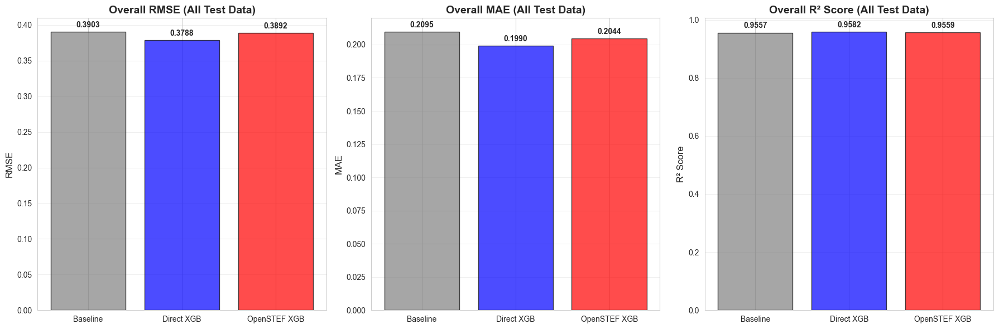
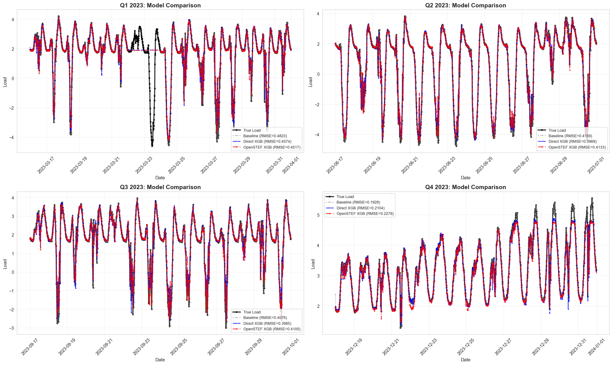
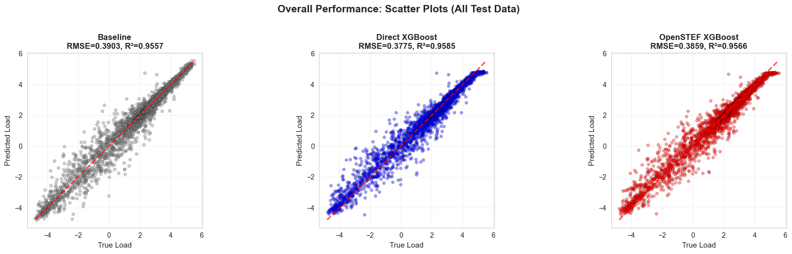

    "Evaluate Combined Quarterly Model Training Results.\n\nThis report evaluates a single combined model trained on all quarters' training data\nand tested on each quarter's test period separately.\n\nThe report:\n1. Loads training results from models/quarterly_split/training_results.json\n2. Recreates predictions for visualization\n3. Creates comprehensive visualizations:\n   - Overall metrics (all test data combined)\n   - Time series plots for each quarter's test period\n   - Scatter plots for overall performance\n   - Per-quarter metrics comparison\n4. Exports metrics to metrics/quarterly_split_evaluation.json for DVC tracking\n\nThis script is designed to be run via generate_report.sh to produce HTML and Markdown outputs.\nUses Jupyter cell blocks (# %%) for interactive execution.\n"

    ======================================================================
    QUARTERLY MODEL EVALUATION REPORT
    ======================================================================
    Experiment: quarterly_split

    
    Loading results from: /home/chris/research/load-forecast/models/quarterly_split/training_results.json
    Loaded results for combined model
    Training timestamp: 2025-12-23T09:32:37.047522
    Description: Combined model trained on all quarters, evaluated on each quarter separately
    Quarters evaluated: 4

    
    ======================================================================
    EXPERIMENT CONFIGURATION
    ======================================================================
    Test days per quarter: 14
    Minimum data coverage: 95.0%
    Random seed: 42
    Training period: 2023-01-15 00:15:00 to 2023-12-17 00:00:00
    Test period: 2023-03-16 00:00:00 to 2023-12-31 23:00:00

    
    ======================================================================
    LOADING DATA FOR VISUALIZATION
    ======================================================================

    Loaded data shape: (31705, 133)
    Full data shape (with NaN): (35041, 133)

    
    ======================================================================
    RECREATING COMBINED MODEL PREDICTIONS
    ======================================================================
    Training one model on ALL quarters, testing on each quarter separately

    
    Preparing data splits for 4 quarters...
      Q1 2023: 5437 train, 1344 test
      Q2 2023: 5786 train, 1344 test
      Q3 2023: 7393 train, 1344 test
      Q4 2023: 7227 train, 1341 test
    
    Combined training data: 25843 rows
    Training combined models...
      - Baseline...
      - Direct XGBoost...

      - OpenSTEF XGBoost...

    [0]	validation_0-rmse:1.36278	validation_1-rmse:1.42102

    [1]	validation_0-rmse:0.99345	validation_1-rmse:1.05672

    [2]	validation_0-rmse:0.74509	validation_1-rmse:0.81884

    [3]	validation_0-rmse:0.58266	validation_1-rmse:0.67092

    [4]	validation_0-rmse:0.47914	validation_1-rmse:0.58428

    [5]	validation_0-rmse:0.41649	validation_1-rmse:0.53548

    [6]	validation_0-rmse:0.37794	validation_1-rmse:0.50893

    [7]	validation_0-rmse:0.35392	validation_1-rmse:0.49581

    [8]	validation_0-rmse:0.33949	validation_1-rmse:0.48994

    [9]	validation_0-rmse:0.32879	validation_1-rmse:0.49019

    [10]	validation_0-rmse:0.31980	validation_1-rmse:0.48919

    [11]	validation_0-rmse:0.31326	validation_1-rmse:0.49067

    [12]	validation_0-rmse:0.30749	validation_1-rmse:0.49220

    [13]	validation_0-rmse:0.30267	validation_1-rmse:0.49220

    [14]	validation_0-rmse:0.29870	validation_1-rmse:0.49210

    [15]	validation_0-rmse:0.29495	validation_1-rmse:0.49206

    [16]	validation_0-rmse:0.29151	validation_1-rmse:0.49168

    [17]	validation_0-rmse:0.28901	validation_1-rmse:0.49157

    [18]	validation_0-rmse:0.28568	validation_1-rmse:0.49243

    [19]	validation_0-rmse:0.28118	validation_1-rmse:0.49327

    [20]	validation_0-rmse:0.27779	validation_1-rmse:0.49305

    
    Generating predictions for each quarter's test set...
      Q1 2023...

      Q2 2023...

      Q3 2023...

      Q4 2023...

    Predictions recreated for all quarters

    
    ======================================================================
    ORGANIZING METRICS
    ======================================================================
    Organized metrics for 4 quarters

    
    ======================================================================
    OVERALL METRICS (ALL TEST DATA COMBINED)
    ======================================================================
    
    Model              RMSE         MAE          R²          
    ------------------------------------------------------
    baseline           0.3903       0.2095       0.9557      
    direct_xgb         0.3775       0.1978       0.9585      
    openstef_xgb       0.3859       0.2033       0.9566      

    

    

    
    ======================================================================
    TIME SERIES VISUALIZATIONS
    ======================================================================

    

    

    
    ======================================================================
    SCATTER PLOTS (OVERALL - ALL TEST DATA)
    ======================================================================

    

    

    
    ======================================================================
    PER-QUARTER METRICS BREAKDOWN
    ======================================================================
    
    Quarter         Model              RMSE         MAE          R²          
    ---------------------------------------------------------------------------
    Q1 2023         baseline           0.4823       0.2502       0.9096      
    Q1 2023         direct_xgb         0.4574       0.2278       0.9187      
    Q1 2023         openstef_xgb       0.4517       0.2296       0.9207      
    ---------------------------------------------------------------------------
    Q2 2023         baseline           0.4159       0.2504       0.9682      
    Q2 2023         direct_xgb         0.3969       0.2309       0.9711      
    Q2 2023         openstef_xgb       0.4133       0.2349       0.9686      
    ---------------------------------------------------------------------------
    Q3 2023         baseline           0.4076       0.2256       0.9069      
    Q3 2023         direct_xgb         0.3985       0.2149       0.9110      
    Q3 2023         openstef_xgb       0.4105       0.2173       0.9056      
    ---------------------------------------------------------------------------
    Q4 2023         baseline           0.1928       0.1116       0.9559      
    Q4 2023         direct_xgb         0.2104       0.1175       0.9475      
    Q4 2023         openstef_xgb       0.2279       0.1312       0.9384      
    ---------------------------------------------------------------------------

    

    

    
    ======================================================================
    EXPORTING METRICS FOR DVC TRACKING
    ======================================================================
    ✓ Metrics saved to: metrics/quarterly_split_evaluation.json

    
    ======================================================================
    EVALUATION REPORT COMPLETE
    ======================================================================
    
    ✓ Analyzed 4 quarters
    ✓ Compared 3 models: Baseline, Direct XGBoost, OpenSTEF XGBoost
    ✓ Metrics exported to: metrics/quarterly_split_evaluation.json
    
    Overall Results (All Test Data Combined):
      BASELINE: RMSE=0.3903, MAE=0.2095, R²=0.9557
      DIRECT_XGB: RMSE=0.3775, MAE=0.1978, R²=0.9585
      OPENSTEF_XGB: RMSE=0.3859, MAE=0.2033, R²=0.9566

