    'Evaluate Quarterly Model Training Results.\n\nThis report:\n1. Loads training results from models/quarterly_split/training_results.json\n2. Loads the original data to get actual load values and predictions\n3. Creates comprehensive visualizations:\n   - Line plots comparing all three models per quarter\n   - Scatter plots for each model per quarter\n   - Error distribution histograms\n   - Metrics comparison bar charts across quarters\n   - Aggregated metrics summary\n4. Exports metrics to metrics/quarterly_split_evaluation.json for DVC tracking\n\nThis script is designed to be run via generate_report.sh to produce HTML and Markdown outputs.\nUses Jupyter cell blocks (# %%) for interactive execution.\n'

    ======================================================================
    QUARTERLY MODEL EVALUATION REPORT
    ======================================================================
    Experiment: quarterly_split

    
    Loading results from: /home/chris/research/load-forecast/models/quarterly_split/training_results.json
    Loaded results for 4 quarters
    Training timestamp: 2025-12-22T20:48:43.973827

    
    ======================================================================
    EXPERIMENT CONFIGURATION
    ======================================================================
    Test days per quarter: 14
    Minimum data coverage: 95.0%
    Random seed: 42

    
    ======================================================================
    LOADING DATA FOR VISUALIZATION
    ======================================================================

    Loaded data shape: (31705, 133)
    Full data shape (with NaN): (35041, 133)

    
    ======================================================================
    RECREATING PREDICTIONS FOR VISUALIZATION
    ======================================================================

    Processing Q1 2023...

    [0]	validation_0-rmse:0.98521	validation_1-rmse:0.94609

    [1]	validation_0-rmse:0.72297	validation_1-rmse:0.71563

    [2]	validation_0-rmse:0.54169	validation_1-rmse:0.57017

    [3]	validation_0-rmse:0.41739	validation_1-rmse:0.48128

    [4]	validation_0-rmse:0.33395	validation_1-rmse:0.43137

    [5]	validation_0-rmse:0.27808	validation_1-rmse:0.40879

    [6]	validation_0-rmse:0.24127	validation_1-rmse:0.39371

    [7]	validation_0-rmse:0.21547	validation_1-rmse:0.38680

    [8]	validation_0-rmse:0.19742	validation_1-rmse:0.38567

    [9]	validation_0-rmse:0.18564	validation_1-rmse:0.38353

    [10]	validation_0-rmse:0.17447	validation_1-rmse:0.37888

    [11]	validation_0-rmse:0.16638	validation_1-rmse:0.37876

    [12]	validation_0-rmse:0.16043	validation_1-rmse:0.38200

    [13]	validation_0-rmse:0.15431	validation_1-rmse:0.38195

    [14]	validation_0-rmse:0.15006	validation_1-rmse:0.38320

    [15]	validation_0-rmse:0.14738	validation_1-rmse:0.38202

    [16]	validation_0-rmse:0.14370	validation_1-rmse:0.38320

    [17]	validation_0-rmse:0.14156	validation_1-rmse:0.38389

    [18]	validation_0-rmse:0.13843	validation_1-rmse:0.38055

    [19]	validation_0-rmse:0.13688	validation_1-rmse:0.38396

    [20]	validation_0-rmse:0.13420	validation_1-rmse:0.38391

    

    [21]	validation_0-rmse:0.13189	validation_1-rmse:0.38378

    Processing Q2 2023...

    [0]	validation_0-rmse:1.68846	validation_1-rmse:1.59006

    [1]	validation_0-rmse:1.21295	validation_1-rmse:1.16844

    [2]	validation_0-rmse:0.88443	validation_1-rmse:0.90140

    [3]	validation_0-rmse:0.65930	validation_1-rmse:0.73024

    [4]	validation_0-rmse:0.50918	validation_1-rmse:0.62713

    [5]	validation_0-rmse:0.41088	validation_1-rmse:0.56806

    [6]	validation_0-rmse:0.34716	validation_1-rmse:0.53689

    [7]	validation_0-rmse:0.30532	validation_1-rmse:0.52940

    [8]	validation_0-rmse:0.27710	validation_1-rmse:0.52171

    [9]	validation_0-rmse:0.25833	validation_1-rmse:0.51664

    [10]	validation_0-rmse:0.24600	validation_1-rmse:0.51381

    [11]	validation_0-rmse:0.23712	validation_1-rmse:0.51076

    [12]	validation_0-rmse:0.23003	validation_1-rmse:0.50861

    [13]	validation_0-rmse:0.22505	validation_1-rmse:0.50724

    [14]	validation_0-rmse:0.21687	validation_1-rmse:0.50947

    [15]	validation_0-rmse:0.21174	validation_1-rmse:0.51090

    [16]	validation_0-rmse:0.20559	validation_1-rmse:0.51048

    [17]	validation_0-rmse:0.19993	validation_1-rmse:0.50944

    [18]	validation_0-rmse:0.19216	validation_1-rmse:0.50980

    [19]	validation_0-rmse:0.18725	validation_1-rmse:0.50877

    [20]	validation_0-rmse:0.18353	validation_1-rmse:0.50894

    [21]	validation_0-rmse:0.18023	validation_1-rmse:0.51029

    [22]	validation_0-rmse:0.17885	validation_1-rmse:0.51126

    [23]	validation_0-rmse:0.17531	validation_1-rmse:0.51097

    Processing Q3 2023...

    [0]	validation_0-rmse:1.52705	validation_1-rmse:1.59280

    [1]	validation_0-rmse:1.12163	validation_1-rmse:1.19318

    [2]	validation_0-rmse:0.84746	validation_1-rmse:0.93542

    [3]	validation_0-rmse:0.66577	validation_1-rmse:0.75866

    [4]	validation_0-rmse:0.54750	validation_1-rmse:0.65514

    [5]	validation_0-rmse:0.47056	validation_1-rmse:0.59619

    [6]	validation_0-rmse:0.42285	validation_1-rmse:0.56145

    [7]	validation_0-rmse:0.39141	validation_1-rmse:0.54377

    [8]	validation_0-rmse:0.36814	validation_1-rmse:0.53177

    [9]	validation_0-rmse:0.35136	validation_1-rmse:0.52472

    [10]	validation_0-rmse:0.33936	validation_1-rmse:0.52442

    [11]	validation_0-rmse:0.33093	validation_1-rmse:0.52691

    [12]	validation_0-rmse:0.31974	validation_1-rmse:0.53327

    [13]	validation_0-rmse:0.30896	validation_1-rmse:0.53285

    [14]	validation_0-rmse:0.30002	validation_1-rmse:0.53277

    [15]	validation_0-rmse:0.29064	validation_1-rmse:0.53407

    [16]	validation_0-rmse:0.28275	validation_1-rmse:0.53214

    [17]	validation_0-rmse:0.27396	validation_1-rmse:0.53313

    [18]	validation_0-rmse:0.26773	validation_1-rmse:0.53601

    [19]	validation_0-rmse:0.26245	validation_1-rmse:0.53841

    [20]	validation_0-rmse:0.25772	validation_1-rmse:0.53952

    Processing Q4 2023...

    [0]	validation_0-rmse:0.79140	validation_1-rmse:0.63379

    [1]	validation_0-rmse:0.58840	validation_1-rmse:0.48177

    [2]	validation_0-rmse:0.45101	validation_1-rmse:0.39141

    [3]	validation_0-rmse:0.36097	validation_1-rmse:0.33506

    [4]	validation_0-rmse:0.30050	validation_1-rmse:0.30394

    [5]	validation_0-rmse:0.26240	validation_1-rmse:0.29030

    [6]	validation_0-rmse:0.23584	validation_1-rmse:0.28057

    [7]	validation_0-rmse:0.21913	validation_1-rmse:0.27548

    [8]	validation_0-rmse:0.20510	validation_1-rmse:0.27676

    [9]	validation_0-rmse:0.19563	validation_1-rmse:0.27615

    [10]	validation_0-rmse:0.18520	validation_1-rmse:0.27665

    [11]	validation_0-rmse:0.17702	validation_1-rmse:0.27569

    [12]	validation_0-rmse:0.16957	validation_1-rmse:0.27576

    [13]	validation_0-rmse:0.16314	validation_1-rmse:0.27539

    [14]	validation_0-rmse:0.15907	validation_1-rmse:0.27613

    [15]	validation_0-rmse:0.15360	validation_1-rmse:0.27707

    [16]	validation_0-rmse:0.14960	validation_1-rmse:0.27725

    [17]	validation_0-rmse:0.14476	validation_1-rmse:0.27802

    [18]	validation_0-rmse:0.14222	validation_1-rmse:0.27773

    [19]	validation_0-rmse:0.14030	validation_1-rmse:0.27949

    [20]	validation_0-rmse:0.13794	validation_1-rmse:0.27960

    [21]	validation_0-rmse:0.13373	validation_1-rmse:0.27884

    [22]	validation_0-rmse:0.13088	validation_1-rmse:0.27719

    [23]	validation_0-rmse:0.12840	validation_1-rmse:0.27663

    Predictions recreated for all quarters

    
    ======================================================================
    EXPORTING METRICS FOR DVC TRACKING
    ======================================================================
    ✓ Metrics saved to: metrics/quarterly_split_evaluation.json

    
    ======================================================================
    RESULTS SUMMARY
    ======================================================================
    
    Quarter         Model              RMSE         MAE          R²          
    ---------------------------------------------------------------------------
    Q1 2023         baseline           0.4823       0.2502       0.9096      
    Q1 2023         direct_xgb         0.5134       0.2709       0.8975      
    Q1 2023         openstef_xgb       0.4993       0.2609       0.9031      
    ---------------------------------------------------------------------------
    Q2 2023         baseline           0.4159       0.2504       0.9682      
    Q2 2023         direct_xgb         0.4600       0.2710       0.9611      
    Q2 2023         openstef_xgb       0.4954       0.2923       0.9549      
    ---------------------------------------------------------------------------
    Q3 2023         baseline           0.4076       0.2256       0.9069      
    Q3 2023         direct_xgb         0.4196       0.2381       0.9014      
    Q3 2023         openstef_xgb       0.4282       0.2460       0.8973      
    ---------------------------------------------------------------------------
    Q4 2023         baseline           0.1928       0.1116       0.9559      
    Q4 2023         direct_xgb         0.2049       0.1168       0.9502      
    Q4 2023         openstef_xgb       0.2171       0.1232       0.9441      
    ---------------------------------------------------------------------------

    
    ======================================================================
    AGGREGATED METRICS (MEAN ± STD)
    ======================================================================
    
    BASELINE:
      RMSE: 0.3747 ± 0.1089
      MAE: 0.2094 ± 0.0574
      R2: 0.9352 ± 0.0273
    
    DIRECT_XGB:
      RMSE: 0.3995 ± 0.1172
      MAE: 0.2242 ± 0.0634
      R2: 0.9276 ± 0.0284
    
    OPENSTEF_XGB:
      RMSE: 0.4100 ± 0.1149
      MAE: 0.2306 ± 0.0642
      R2: 0.9248 ± 0.0250

    
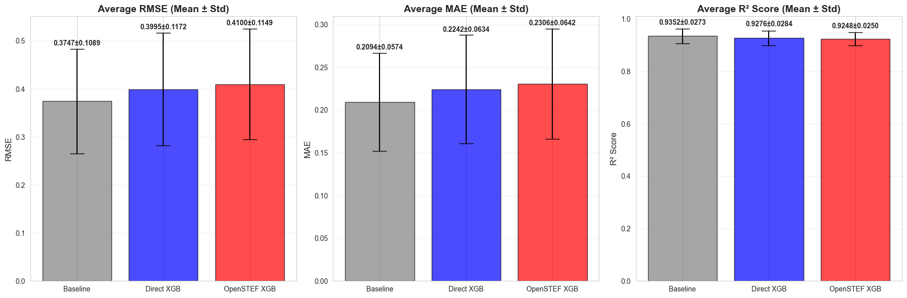
    

    
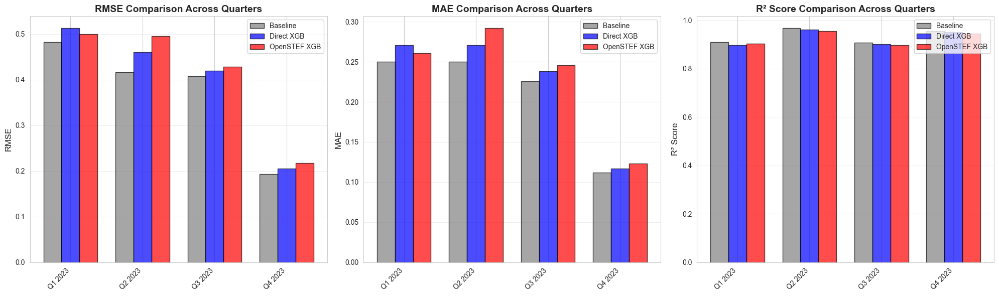
    

    
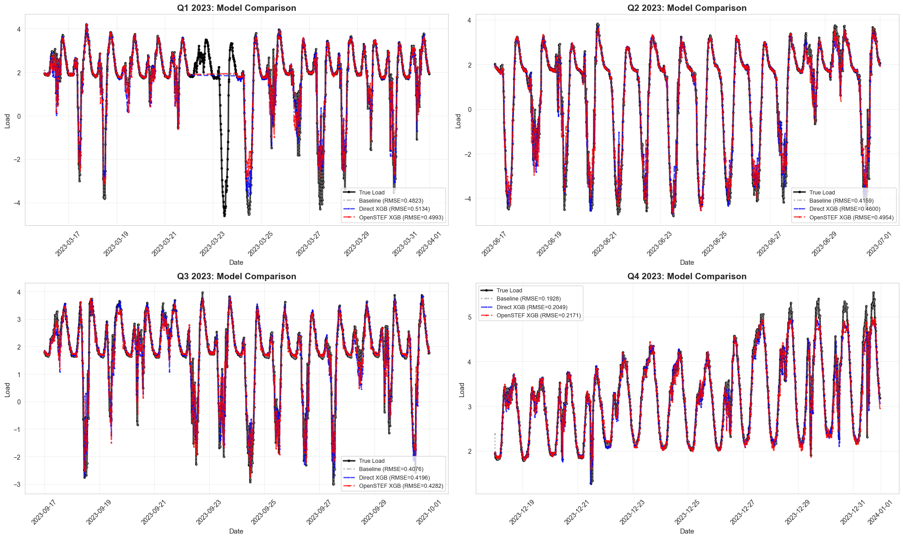
    

    
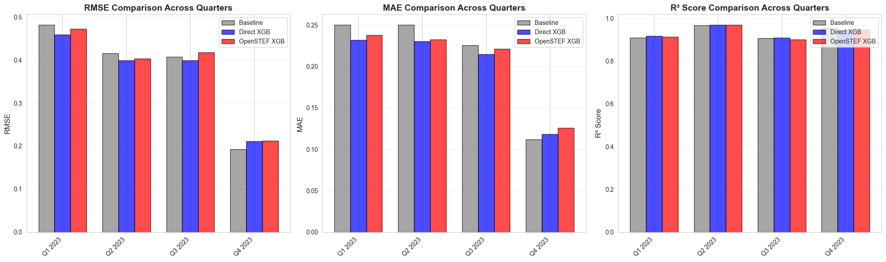
    

    
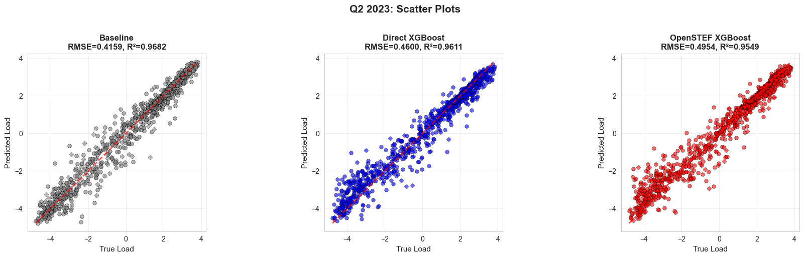
    

    
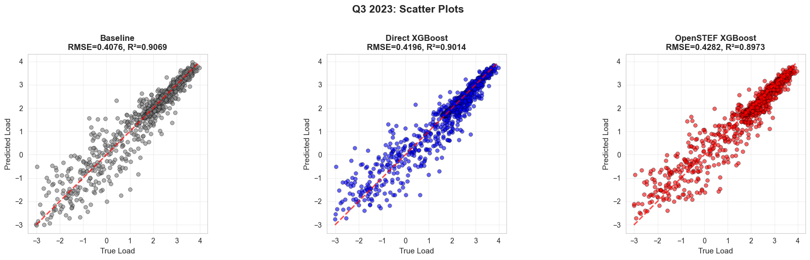
    

    
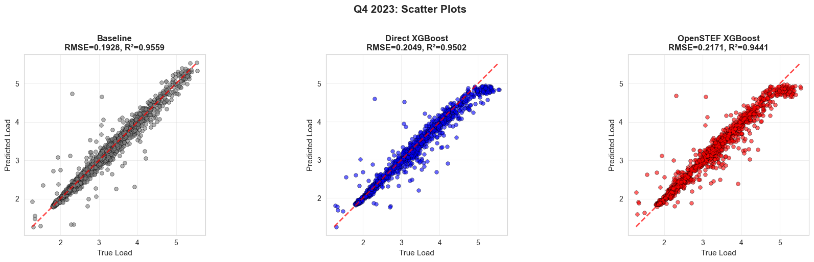
    

    
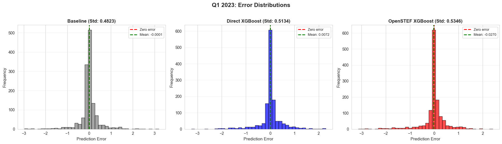
    

    
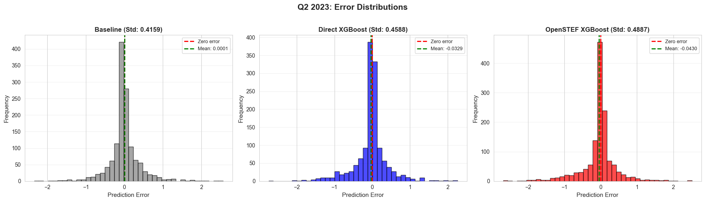
    

    
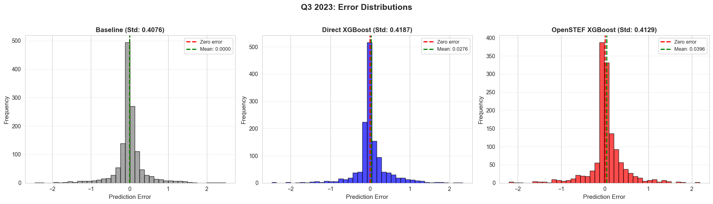
    

    
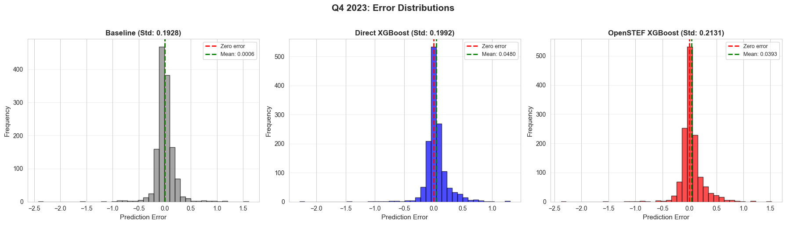
    

    
    ======================================================================
    EVALUATION REPORT COMPLETE
    ======================================================================
    
    ✓ Analyzed 4 quarters
    ✓ Compared 3 models: Baseline, Direct XGBoost, OpenSTEF XGBoost
    ✓ Metrics exported to: metrics/quarterly_split_evaluation.json
    
    Key Findings:
      - Best average RMSE: 0.3747 (Baseline)
      - Best average MAE: 0.2094 (Baseline)
      - Best average R²: 0.9352 (Baseline)

