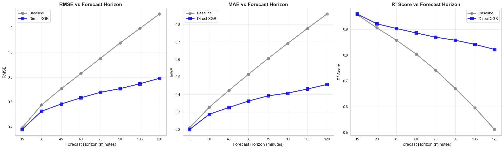
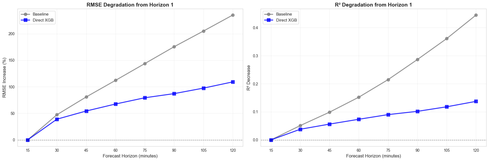
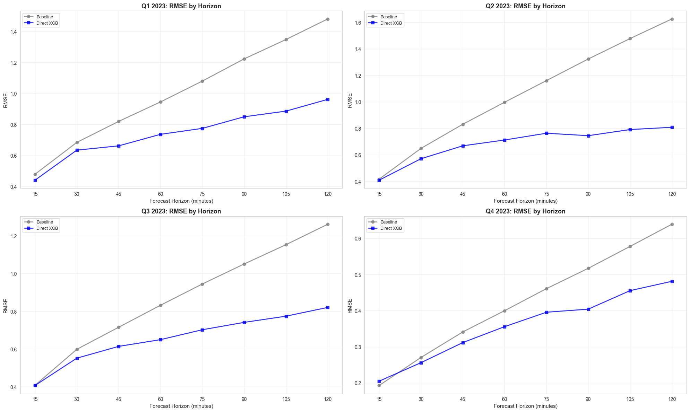
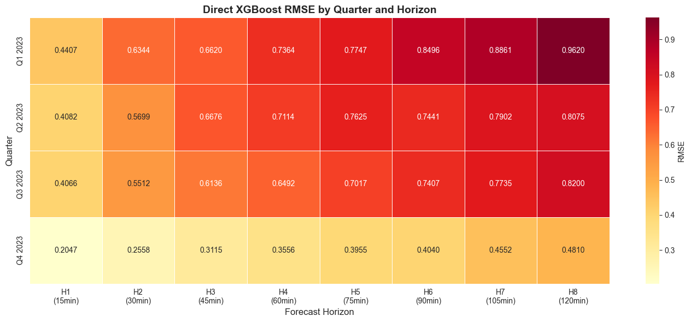

    'Train and Evaluate Multi-Horizon Models using Quarterly Splits.\n\nThis script trains and evaluates multi-horizon models (forecasting 1-8 periods ahead, 15min to 2h):\n1. Loads preprocessed feature-enriched data from data/processed/data_with_features.csv\n2. Splits data into train/test using quarterly splits (centralized function)\n3. For each horizon (1-8 periods ahead):\n   - Uses features known ahead: time-based (cyclic, categorical, holidays, etc.)\n   - Uses forecast features: shifted appropriately for each horizon\n   - Trains baseline (persistence) and direct XGBoost models\n4. Evaluates on overall test data and individual quarterly test periods\n5. Creates comprehensive visualizations and analysis\n6. Saves training results and exports metrics for DVC tracking\n\nUses Jupyter cell blocks (# %%) for interactive execution.\n'

    ======================================================================
    MULTI-HORIZON QUARTERLY MODEL TRAINING AND EVALUATION
    ======================================================================
    Experiment: multi_horizon_quarterly
    Forecast horizons: 8 periods (15 min to 120 min)
    Test period: Last 14 days per quarter
    Minimum data coverage: 95.0%
    Random seed: 42

    
    ======================================================================
    LOADING FEATURE-ENRICHED DATA
    ======================================================================
    Loading from: /home/chris/research/load-forecast/data/processed/data_with_features.csv
    Ensured all directories exist relative to: /home/chris/research/load-forecast

    Loaded data shape: (35041, 133)
    Date range: 2023-01-01 00:00:00 to 2024-01-01 00:00:00
    Number of features: 133

    
    ======================================================================
    CLEANING DATA - REMOVING ROWS WITH MISSING VALUES
    ======================================================================
    Shape before cleaning: (35041, 133)
    Shape after dropping NaN: (31705, 133)
    Date range: 2023-01-15 00:15:00 to 2023-12-31 23:00:00

    
    ======================================================================
    CATEGORIZING FEATURES BY AVAILABILITY
    ======================================================================
    
    Features known multi-period ahead (time-based): 31
    Features from 1-period forecasts (need shifting): 101
    
    ----------------------------------------------------------------------
    KNOWN AHEAD FEATURES:
    ----------------------------------------------------------------------
      1. IsSunday
      2. IsWeekDay
      3. IsWeekendDay
      4. Month
      5. Quarter
      6. day0fweek_cosine
      7. day0fweek_sine
      8. daylight_continuous
      9. is_bevrijdingsdag
     10. is_bridgeday
     11. is_eerste_kerstdag
     12. is_eerste_paasdag
     13. is_eerste_pinksterdag
     14. is_goede_vrijdag
     15. is_hemelvaart
     16. is_herfstvakantiemidden
     17. is_kerstvakantie
     18. is_koningsdag
     19. is_national_holiday
     20. is_nieuwjaarsdag
     21. is_schoolholiday
     22. is_tweede_kerstdag
     23. is_tweede_paasdag
     24. is_tweede_pinksterdag
     25. is_voorjaarsvakantiemidden
     26. month_cosine
     27. month_sine
     28. season_cosine
     29. season_sine
     30. time0fday_cosine
     31. time0fday_sine
    
    ----------------------------------------------------------------------
    FORECAST FEATURES (first 20):
    ----------------------------------------------------------------------
      1. APX
      2. E1A_AMI_A
      3. E1A_AMI_I
      4. E1A_AZI_A
      5. E1A_AZI_I
      6. E1B_AMI_A
      7. E1B_AMI_I
      8. E1B_AZI_A
      9. E1B_AZI_I
     10. E1C_AMI_A
     11. E1C_AMI_I
     12. E1C_AZI_A
     13. E1C_AZI_I
     14. E2A_AMI_A
     15. E2A_AMI_I
     16. E2A_AZI_A
     17. E2A_AZI_I
     18. E2B_AMI_A
     19. E2B_AMI_I
     20. E2B_AZI_A
    ... and 81 more

    
    ======================================================================
    SPLITTING DATA INTO TRAIN/TEST BY QUARTERS
    ======================================================================
    
    Combined train size: 25843 rows (across 4 quarters)
    Combined test size: 5482 rows
    Train period: 2023-01-15 00:15:00 to 2023-12-17 00:00:00
    Test period: 2023-03-16 00:00:00 to 2023-12-31 23:00:00
    
    Quarter breakdown:
      Q1 2023: Train 5437 rows, Test 1453 rows
      Q2 2023: Train 5786 rows, Test 1344 rows
      Q3 2023: Train 7393 rows, Test 1344 rows
      Q4 2023: Train 7227 rows, Test 1341 rows

    
    ======================================================================
    PREPARING MULTI-HORIZON DATASETS
    ======================================================================

    Combined data shape: (31325, 133)
    Train rows: 25843
    Test rows: 5482

    Creating 8 multi-horizon datasets...

    
    Dataset sizes by horizon:
      Horizon 1 (15min): Train 25843, Test 5482, Features 132
      Horizon 2 (30min): Train 25842, Test 5482, Features 132
      Horizon 3 (45min): Train 25841, Test 5482, Features 132
      Horizon 4 (60min): Train 25840, Test 5482, Features 132
      Horizon 5 (75min): Train 25839, Test 5482, Features 132
      Horizon 6 (90min): Train 25838, Test 5482, Features 132
      Horizon 7 (105min): Train 25837, Test 5482, Features 132
      Horizon 8 (120min): Train 25836, Test 5482, Features 132

    
    Experiment directory: /home/chris/research/load-forecast/models/multi_horizon_quarterly

    
    ======================================================================
    TRAINING MULTI-HORIZON MODELS
    ======================================================================
    
    ======================================================================
    HORIZON 1 (15 minutes ahead)
    ======================================================================
    Train size: 25843 rows
    Test size: 5482 rows
    
    [H1] Training Baseline (Persistence) Model...
      RMSE: 0.3912, MAE: 0.2092, R²: 0.9565
    
    [H1] Training Direct XGBoost Model...

      RMSE: 0.3783, MAE: 0.1999, R²: 0.9593
    
    ======================================================================
    HORIZON 2 (30 minutes ahead)
    ======================================================================
    Train size: 25842 rows
    Test size: 5482 rows
    
    [H2] Training Baseline (Persistence) Model...
      RMSE: 0.5767, MAE: 0.3272, R²: 0.9055
    
    [H2] Training Direct XGBoost Model...

      RMSE: 0.5261, MAE: 0.2869, R²: 0.9213
    
    ======================================================================
    HORIZON 3 (45 minutes ahead)
    ======================================================================
    Train size: 25841 rows
    Test size: 5482 rows
    
    [H3] Training Baseline (Persistence) Model...
      RMSE: 0.7077, MAE: 0.4230, R²: 0.8576
    
    [H3] Training Direct XGBoost Model...

      RMSE: 0.5843, MAE: 0.3257, R²: 0.9029
    
    ======================================================================
    HORIZON 4 (60 minutes ahead)
    ======================================================================
    Train size: 25840 rows
    Test size: 5482 rows
    
    [H4] Training Baseline (Persistence) Model...
      RMSE: 0.8299, MAE: 0.5159, R²: 0.8042
    
    [H4] Training Direct XGBoost Model...

      RMSE: 0.6341, MAE: 0.3626, R²: 0.8857
    
    ======================================================================
    HORIZON 5 (75 minutes ahead)
    ======================================================================
    Train size: 25839 rows
    Test size: 5482 rows
    
    [H5] Training Baseline (Persistence) Model...
      RMSE: 0.9535, MAE: 0.6056, R²: 0.7415
    
    [H5] Training Direct XGBoost Model...

      RMSE: 0.6787, MAE: 0.3924, R²: 0.8691
    
    ======================================================================
    HORIZON 6 (90 minutes ahead)
    ======================================================================
    Train size: 25838 rows
    Test size: 5482 rows
    
    [H6] Training Baseline (Persistence) Model...
      RMSE: 1.0776, MAE: 0.6925, R²: 0.6699
    
    [H6] Training Direct XGBoost Model...

      RMSE: 0.7081, MAE: 0.4078, R²: 0.8575
    
    ======================================================================
    HORIZON 7 (105 minutes ahead)
    ======================================================================
    Train size: 25837 rows
    Test size: 5482 rows
    
    [H7] Training Baseline (Persistence) Model...
      RMSE: 1.1931, MAE: 0.7770, R²: 0.5953
    
    [H7] Training Direct XGBoost Model...

      RMSE: 0.7473, MAE: 0.4313, R²: 0.8412
    
    ======================================================================
    HORIZON 8 (120 minutes ahead)
    ======================================================================
    Train size: 25836 rows
    Test size: 5482 rows
    
    [H8] Training Baseline (Persistence) Model...
      RMSE: 1.3109, MAE: 0.8603, R²: 0.5115
    
    [H8] Training Direct XGBoost Model...

      RMSE: 0.7916, MAE: 0.4575, R²: 0.8219

    
    ======================================================================
    EVALUATING ON INDIVIDUAL QUARTERLY TEST SETS (ALL HORIZONS)
    ======================================================================
    
    Q1 2023:
      Horizon 1 (15min) - Baseline RMSE: 0.4788, Direct XGB RMSE: 0.4407
      Horizon 8 (120min) - Baseline RMSE: 1.4809, Direct XGB RMSE: 0.9620
    
    Q2 2023:

      Horizon 1 (15min) - Baseline RMSE: 0.4159, Direct XGB RMSE: 0.4082
      Horizon 8 (120min) - Baseline RMSE: 1.6255, Direct XGB RMSE: 0.8075
    
    Q3 2023:
      Horizon 1 (15min) - Baseline RMSE: 0.4076, Direct XGB RMSE: 0.4066
      Horizon 8 (120min) - Baseline RMSE: 1.2605, Direct XGB RMSE: 0.8200
    
    Q4 2023:

      Horizon 1 (15min) - Baseline RMSE: 0.1928, Direct XGB RMSE: 0.2047
      Horizon 8 (120min) - Baseline RMSE: 0.6389, Direct XGB RMSE: 0.4810

    
    ======================================================================
    SAVING TRAINING RESULTS
    ======================================================================
    Results saved to: /home/chris/research/load-forecast/models/multi_horizon_quarterly/training_results.json

    
    ======================================================================
    CREATING VISUALIZATIONS
    ======================================================================

    
    ======================================================================
    OVERALL METRICS BY HORIZON (ALL TEST DATA COMBINED)
    ======================================================================
    
    Horizon    Minutes    Model              RMSE         MAE          R²          
    --------------------------------------------------------------------------------
    1          15         baseline           0.3912       0.2092       0.9565      
    1          15         direct_xgb         0.3783       0.1999       0.9593      
    --------------------------------------------------------------------------------
    2          30         baseline           0.5767       0.3272       0.9055      
    2          30         direct_xgb         0.5261       0.2869       0.9213      
    --------------------------------------------------------------------------------
    3          45         baseline           0.7077       0.4230       0.8576      
    3          45         direct_xgb         0.5843       0.3257       0.9029      
    --------------------------------------------------------------------------------
    4          60         baseline           0.8299       0.5159       0.8042      
    4          60         direct_xgb         0.6341       0.3626       0.8857      
    --------------------------------------------------------------------------------
    5          75         baseline           0.9535       0.6056       0.7415      
    5          75         direct_xgb         0.6787       0.3924       0.8691      
    --------------------------------------------------------------------------------
    6          90         baseline           1.0776       0.6925       0.6699      
    6          90         direct_xgb         0.7081       0.4078       0.8575      
    --------------------------------------------------------------------------------
    7          105        baseline           1.1931       0.7770       0.5953      
    7          105        direct_xgb         0.7473       0.4313       0.8412      
    --------------------------------------------------------------------------------
    8          120        baseline           1.3109       0.8603       0.5115      
    8          120        direct_xgb         0.7916       0.4575       0.8219      
    --------------------------------------------------------------------------------

    

    

    
    ======================================================================
    PERFORMANCE DEGRADATION ANALYSIS
    ======================================================================

    

    

    
    Degradation Summary (Horizon 1 → Horizon 8):
    ----------------------------------------------------------------------
    Baseline           RMSE: +235.1%  |  R²: -0.4450
    Direct XGB         RMSE: +109.3%  |  R²: -0.1374

    
    ======================================================================
    PER-QUARTER METRICS BY HORIZON
    ======================================================================
    
    Quarter         Horizon    Minutes    Model              RMSE         MAE          R²          
    -----------------------------------------------------------------------------------------------
    Q1 2023         1          15         baseline           0.4788       0.2460       0.9219      
    Q1 2023         1          15         direct_xgb         0.4407       0.2268       0.9339      
    Q1 2023         8          120        baseline           1.4809       0.9447       0.2534      
    Q1 2023         8          120        direct_xgb         0.9620       0.5355       0.6849      
    -----------------------------------------------------------------------------------------------
    Q2 2023         1          15         baseline           0.4159       0.2504       0.9682      
    Q2 2023         1          15         direct_xgb         0.4082       0.2357       0.9694      
    Q2 2023         8          120        baseline           1.6255       1.1348       0.5149      
    Q2 2023         8          120        direct_xgb         0.8075       0.5076       0.8803      
    -----------------------------------------------------------------------------------------------
    Q3 2023         1          15         baseline           0.4076       0.2256       0.9069      
    Q3 2023         1          15         direct_xgb         0.4066       0.2158       0.9074      
    Q3 2023         8          120        baseline           1.2605       0.8626       0.1098      
    Q3 2023         8          120        direct_xgb         0.8200       0.4674       0.6233      
    -----------------------------------------------------------------------------------------------
    Q4 2023         1          15         baseline           0.1928       0.1116       0.9559      
    Q4 2023         1          15         direct_xgb         0.2047       0.1190       0.9503      
    Q4 2023         8          120        baseline           0.6389       0.4915       0.5155      
    Q4 2023         8          120        direct_xgb         0.4810       0.3130       0.7253      
    -----------------------------------------------------------------------------------------------

    
    ======================================================================
    PER-QUARTER PERFORMANCE ACROSS HORIZONS
    ======================================================================

    

    

    
    ======================================================================
    HEATMAP: RMSE BY QUARTER AND HORIZON (Direct XGBoost)
    ======================================================================

    

    

    
    ======================================================================
    EXPORTING METRICS FOR DVC TRACKING
    ======================================================================
    Metrics saved to: metrics/multi_horizon_quarterly_evaluation.json

    
    ======================================================================
    SUMMARY: BEST AND WORST PERFORMING HORIZONS
    ======================================================================
    
    Baseline:
      Best:  Horizon 1 (15min) - RMSE: 0.3912
      Worst: Horizon 8 (120min) - RMSE: 1.3109
      Range: 0.9197 (235.1% increase)
    
    Direct XGB:
      Best:  Horizon 1 (15min) - RMSE: 0.3783
      Worst: Horizon 8 (120min) - RMSE: 0.7916
      Range: 0.4133 (109.3% increase)

    
    ======================================================================
    TRAINING AND EVALUATION COMPLETE
    ======================================================================
    
    Trained 8 horizons (15min to 120min ahead)
    Models trained on all 4 quarters combined
    Evaluated on 4 individual quarterly test sets
    Using 31 time-based features + 101 forecast features
    Training results saved to: /home/chris/research/load-forecast/models/multi_horizon_quarterly/training_results.json
    Metrics exported to: metrics/multi_horizon_quarterly_evaluation.json
    
    Key Findings:
      Baseline: RMSE increases 235.1% from H1 to H8 (15min → 120min)
      Direct XGB: RMSE increases 109.3% from H1 to H8 (15min → 120min)

