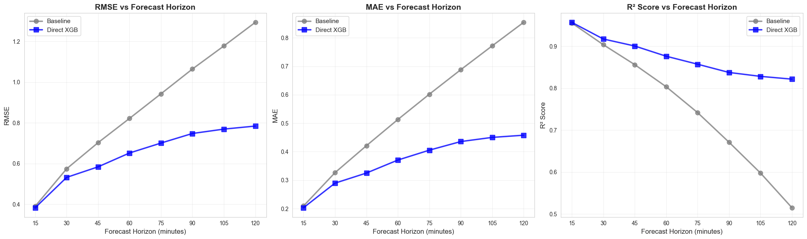
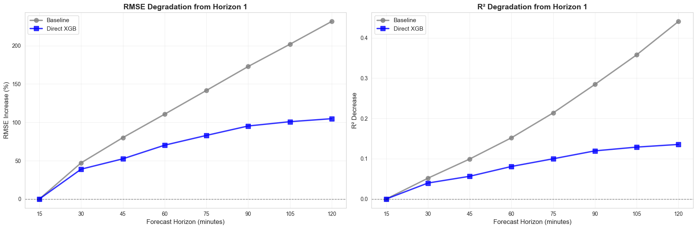
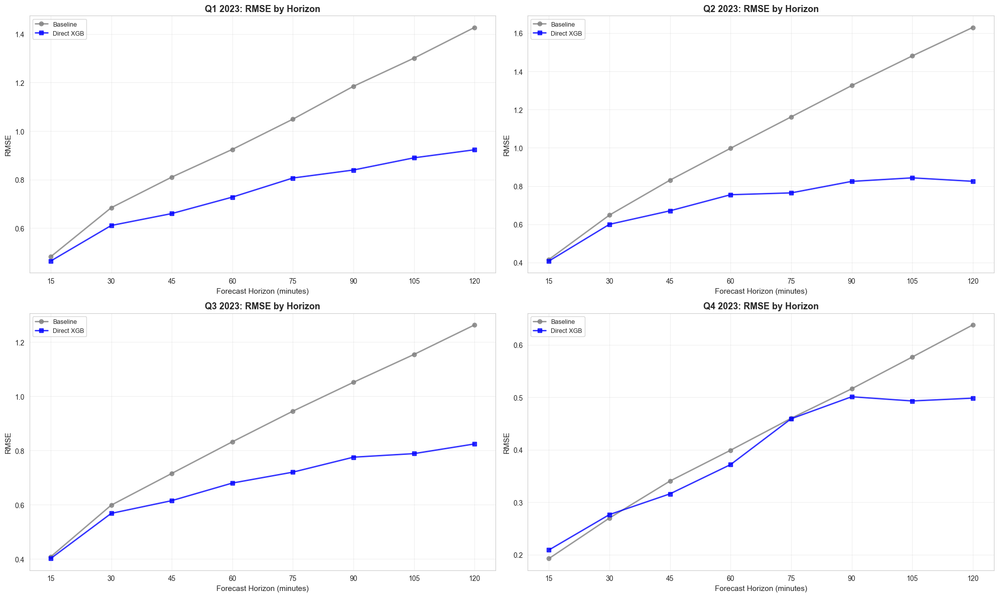
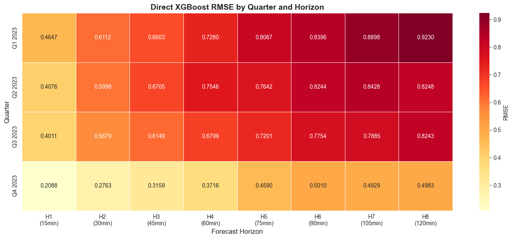

    "Evaluate Multi-Horizon Quarterly Model Training Results.\n\nThis report evaluates multi-horizon models (forecasting 1-8 periods ahead, 15min to 2h)\ntrained on all quarters' training data and tested on each quarter's test period separately.\n\nThe report:\n1. Loads training results from models/multi_horizon_quarterly/training_results.json\n2. Creates comprehensive visualizations:\n   - Overall metrics by horizon (all test data combined)\n   - Performance degradation across horizons\n   - Per-quarter metrics by horizon\n   - Horizon comparison plots\n3. Exports metrics to metrics/multi_horizon_quarterly_evaluation.json for DVC tracking\n\nThis script is designed to be run via generate_report.sh to produce HTML and Markdown outputs.\nUses Jupyter cell blocks (# %%) for interactive execution.\n"

    ======================================================================
    MULTI-HORIZON QUARTERLY MODEL EVALUATION REPORT
    ======================================================================
    Experiment: multi_horizon_quarterly

    
    Loading results from: /home/chris/research/load-forecast/models/multi_horizon_quarterly/training_results.json
    Loaded results for multi-horizon models
    Training timestamp: 2025-12-23T11:51:46.789224
    Description: Multi-horizon models (1-8 periods ahead) trained on all quarters combined, evaluated per quarter. For horizon h: uses time-based features at t+h and forecast features from t (which are already 1-period forecasts in the dataset), shifted back by h-1 periods.
    Number of horizons: 8
    Quarters evaluated: 4

    
    ======================================================================
    EXPERIMENT CONFIGURATION
    ======================================================================
    Number of horizons: 8 (15min to 120min ahead)
    Test days per quarter: 14
    Minimum data coverage: 95.0%
    Random seed: 42
    Time-based features (known ahead): 17
    Forecast features (weather/market/lags): 53
    Other features: 62
    Total features: 132

    
    ======================================================================
    OVERALL METRICS BY HORIZON (ALL TEST DATA COMBINED)
    ======================================================================
    
    Horizon    Minutes    Model              RMSE         MAE          R²          
    --------------------------------------------------------------------------------
    1          15         baseline           0.3902       0.2094       0.9557      
    1          15         direct_xgb         0.3830       0.2033       0.9573      
    --------------------------------------------------------------------------------
    2          30         baseline           0.5743       0.3263       0.9040      
    2          30         direct_xgb         0.5321       0.2895       0.9176      
    --------------------------------------------------------------------------------
    3          45         baseline           0.7028       0.4211       0.8564      
    3          45         direct_xgb         0.5839       0.3250       0.9009      
    --------------------------------------------------------------------------------
    4          60         baseline           0.8220       0.5130       0.8037      
    4          60         direct_xgb         0.6520       0.3707       0.8765      
    --------------------------------------------------------------------------------
    5          75         baseline           0.9429       0.6018       0.7419      
    5          75         direct_xgb         0.7008       0.4054       0.8574      
    --------------------------------------------------------------------------------
    6          90         baseline           1.0647       0.6879       0.6712      
    6          90         direct_xgb         0.7479       0.4356       0.8377      
    --------------------------------------------------------------------------------
    7          105        baseline           1.1780       0.7717       0.5977      
    7          105        direct_xgb         0.7694       0.4503       0.8284      
    --------------------------------------------------------------------------------
    8          120        baseline           1.2941       0.8543       0.5149      
    8          120        direct_xgb         0.7843       0.4579       0.8218      
    --------------------------------------------------------------------------------

    

    

    
    ======================================================================
    PERFORMANCE DEGRADATION ANALYSIS
    ======================================================================

    

    

    
    Degradation Summary (Horizon 1 → Horizon 8):
    ----------------------------------------------------------------------
    Baseline           RMSE: +231.7%  |  R²: -0.4407
    Direct XGB         RMSE: +104.8%  |  R²: -0.1355

    
    ======================================================================
    PER-QUARTER METRICS BY HORIZON
    ======================================================================
    
    Quarter         Horizon    Minutes    Model              RMSE         MAE          R²          
    -----------------------------------------------------------------------------------------------
    Q1 2023         1          15         baseline           0.4823       0.2501       0.9096      
    Q1 2023         1          15         direct_xgb         0.4647       0.2436       0.9161      
    Q1 2023         8          120        baseline           1.4268       0.9203       0.2129      
    Q1 2023         8          120        direct_xgb         0.9230       0.5301       0.6706      
    -----------------------------------------------------------------------------------------------
    Q2 2023         1          15         baseline           0.4159       0.2503       0.9682      
    Q2 2023         1          15         direct_xgb         0.4076       0.2352       0.9695      
    Q2 2023         8          120        baseline           1.6297       1.1402       0.5142      
    Q2 2023         8          120        direct_xgb         0.8248       0.5147       0.8756      
    -----------------------------------------------------------------------------------------------
    Q3 2023         1          15         baseline           0.4076       0.2256       0.9069      
    Q3 2023         1          15         direct_xgb         0.4011       0.2155       0.9098      
    Q3 2023         8          120        baseline           1.2637       0.8661       0.1099      
    Q3 2023         8          120        direct_xgb         0.8243       0.4739       0.6213      
    -----------------------------------------------------------------------------------------------
    Q4 2023         1          15         baseline           0.1925       0.1113       0.9560      
    Q4 2023         1          15         direct_xgb         0.2088       0.1185       0.9482      
    Q4 2023         8          120        baseline           0.6379       0.4898       0.5143      
    Q4 2023         8          120        direct_xgb         0.4983       0.3126       0.7036      
    -----------------------------------------------------------------------------------------------

    
    ======================================================================
    PER-QUARTER PERFORMANCE ACROSS HORIZONS
    ======================================================================

    

    

    
    ======================================================================
    HEATMAP: RMSE BY QUARTER AND HORIZON (Direct XGBoost)
    ======================================================================

    

    

    
    ======================================================================
    EXPORTING METRICS FOR DVC TRACKING
    ======================================================================
    ✓ Metrics saved to: metrics/multi_horizon_quarterly_evaluation.json

    
    ======================================================================
    SUMMARY: BEST AND WORST PERFORMING HORIZONS
    ======================================================================
    
    Baseline:

      Best:  Horizon 1 (15min) - RMSE: 0.3902
      Worst: Horizon 8 (120min) - RMSE: 1.2941
      Range: 0.9039 (231.7% increase)
    
    Direct XGB:
      Best:  Horizon 1 (15min) - RMSE: 0.3830
      Worst: Horizon 8 (120min) - RMSE: 0.7843
      Range: 0.4013 (104.8% increase)

    
    ======================================================================
    EVALUATION REPORT COMPLETE
    ======================================================================
    
    ✓ Analyzed 8 forecast horizons
    ✓ Evaluated 4 quarters
    ✓ Compared 2 models: Baseline and Direct XGBoost
    ✓ Metrics exported to: metrics/multi_horizon_quarterly_evaluation.json
    
    Key Findings:
      Baseline: RMSE increases 231.7% from H1 to H8 (15min → 120min)
      Direct XGB: RMSE increases 104.8% from H1 to H8 (15min → 120min)

